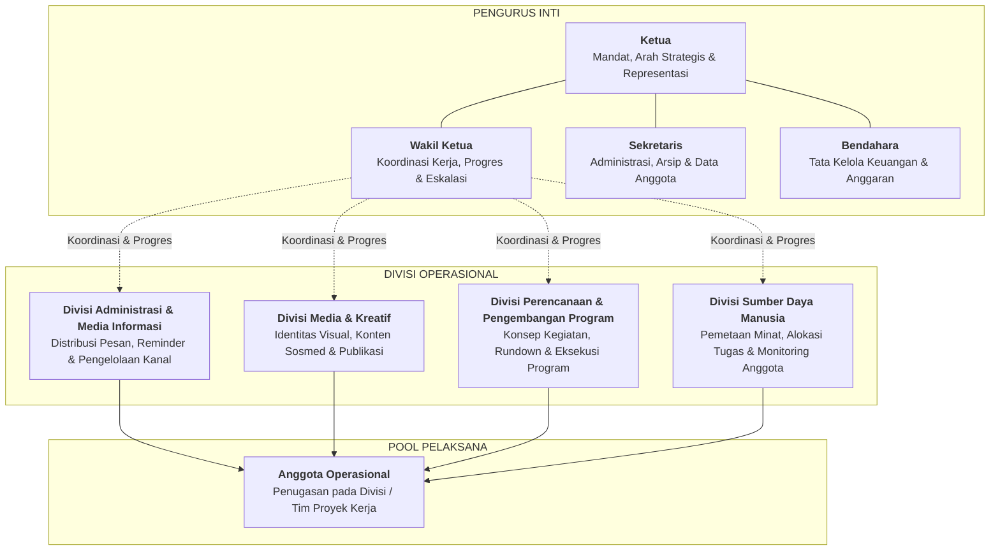
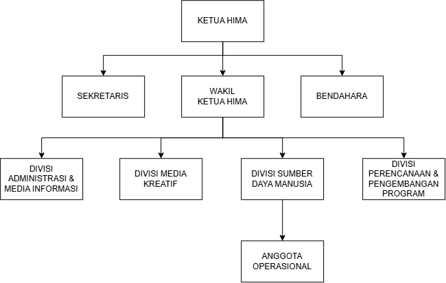
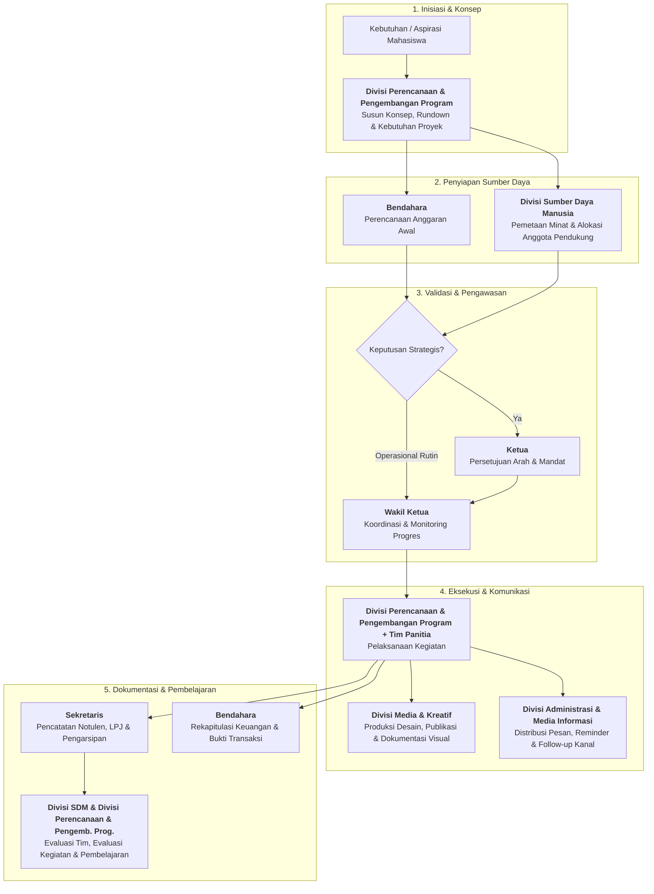

# Struktur dan Peran HIMA

## 1. Tujuan

Dokumen ini menetapkan rancangan struktur kerja HIMA yang ramping, berbasis fungsi, dan dapat dijalankan dengan kapasitas anggota yang masih berkembang.

Rancangan ini disusun untuk menjawab masalah yang teridentifikasi pada diagnosis awal: komunikasi tidak berjalan konsisten, publikasi tidak aktif, organisasi cenderung reaktif, tugas tidak memiliki pemilik yang jelas, serta anggota belum terkelola dan terlibat secara terarah.

Dokumen ini menetapkan fungsi dan batas tanggung jawab. Penempatan nama personel, jumlah anggota per divisi, dan prosedur operasional rinci ditetapkan pada dokumen terpisah.

## 2. Prinsip Struktur

- Fungsi lebih penting daripada banyaknya jabatan.
- Tidak ada fungsi kritis yang boleh kosong hanya karena belum ada divisi besar.
- Struktur harus ramping dan dapat dijalankan oleh anggota yang tersedia.
- Perangkapan fungsi diperbolehkan sementara, tetapi tanggung jawab tetap harus jelas.
- Setiap pekerjaan harus memiliki pemilik, keluaran, dan jalur eskalasi.
- Pengurus inti menjaga mandat, koordinasi, administrasi, dan keuangan.
- Divisi menjaga fungsi operasional organisasi.
- Anggota operasional ditempatkan pada divisi atau proyek berdasarkan kebutuhan, kapasitas, dan minat.
- Program tidak berdiri sebagai divisi tersendiri. Perencanaan hingga pelaksanaan program merupakan mandat Divisi Perencanaan & Pengembangan Program dengan dukungan divisi lain dan anggota operasional.

## 3. Bentuk Struktur





```text
Ketua
Wakil Ketua
Sekretaris
Bendahara

Divisi Operasional (Fase Fondasi & Stabilisasi Internal)
- Divisi Administrasi & Media Informasi
- Divisi Media & Kreatif
- Divisi Perencanaan & Pengembangan Program
- Divisi Sumber Daya Manusia

Divisi Opsional (Fase Ekspansi Lanjutan)
- Divisi Relasi & Kemitraan (diaktifkan setelah fondasi internal terbukti stabil dan mandiri)

Anggota Operasional
- Ditempatkan pada divisi atau ditugaskan pada proyek sesuai kebutuhan
```

Keempat pengurus inti bekerja sebagai satu kepengurusan.

Kepala divisi bertanggung jawab kepada Ketua dan Wakil Ketua sesuai jalur koordinasi yang ditetapkan. Anggota operasional bertanggung jawab kepada kepala divisi atau koordinator proyek yang menugaskannya.

## 4. Pengurus Inti

### Ketua

**Mandat:** Memegang arah, mandat organisasi, keputusan strategis, dan representasi formal HIMA.

**Tanggung jawab:**

- Menjaga agar kegiatan dan keputusan selaras dengan mandat HIMA.
- Mengambil keputusan strategis dan menyelesaikan isu yang tidak dapat diputuskan pada tingkat divisi.
- Menjadi representasi formal HIMA kepada Program Studi, kampus, organisasi lain, dan mitra strategis.
- Menyetujui arah program, prioritas, serta keputusan penting organisasi.
- Memastikan akuntabilitas akhir atas kinerja kepengurusan.

**Bukan mandat utama:**

- Mengerjakan seluruh tugas operasional.
- Menjadi satu-satunya penghubung komunikasi.
- Menggantikan fungsi kepala divisi.

### Wakil Ketua

**Mandat:** Menjaga koordinasi kerja, progres lintas divisi, dan tindak lanjut kepengurusan.

**Tanggung jawab:**

- Mengoordinasikan kepala divisi dan membantu menyelesaikan hambatan lintas divisi.
- Memastikan hasil rapat berubah menjadi penugasan, tenggat, dan tindak lanjut.
- Memantau progres kerja periodik serta mengeskalasi pekerjaan yang macet kepada Ketua.
- Menjadi pengganti Ketua apabila Ketua berhalangan.
- Bekerja bersama Divisi Sumber Daya Manusia untuk menjaga keterlibatan anggota.

**Bukan mandat utama:**

- Mengambil alih seluruh tugas kepala divisi.
- Menjadi satu-satunya pelaksana program.

### Sekretaris

**Mandat:** Memegang administrasi, memori organisasi, dan kebenaran dokumentasi resmi.

**Tanggung jawab:**

- Mengelola struktur kepengurusan, daftar anggota, status keanggotaan, dan data kontak kerja.
- Menyusun dan menyimpan notulen, surat, keputusan, agenda, serta arsip resmi.
- Menjaga repositori atau penyimpanan dokumen agar informasi organisasi dapat ditemukan.
- Mencatat keputusan, penugasan penting, dan perubahan struktur.
- Mendukung kebutuhan administrasi program dan kegiatan.

**Bukan mandat utama:**

- Membuat desain publikasi.
- Menjadi pemilik seluruh komunikasi di grup.

### Bendahara

**Mandat:** Memegang tata kelola keuangan dan kebenaran catatan finansial organisasi.

**Tanggung jawab:**

- Mengelola kas, anggaran, pemasukan, pengeluaran, dan bukti transaksi.
- Menyiapkan perencanaan anggaran untuk kegiatan bersama Divisi Perencanaan & Pengembangan Program dan pihak terkait.
- Menyimpan catatan keuangan serta menyusun laporan keuangan periodik.
- Memberikan informasi kondisi anggaran untuk mendukung keputusan organisasi.
- Menjaga penggunaan dana tetap dapat dipertanggungjawabkan.

**Bukan mandat utama:**

- Memutuskan sendiri prioritas program.
- Menanggung biaya tanpa persetujuan yang berlaku.

## 5. Divisi Operasional

### 5.1 Ringkasan Mandat Tiap Divisi

| Divisi | Fungsi Inti | Bentuk Kerja Nyata |
|---|---|---|
| **Administrasi & Media Informasi** | Memastikan informasi sampai, jelas, dan tidak terlambat | Share pengumuman, reminder rapat/tenggat, format pesan, pengelolaan kanal, follow-up informasi |
| **Media & Kreatif** | Membentuk wajah dan jejak publik HIMA | Desain sertifikat, poster, banner, materi publikasi, konten sosmed, dokumentasi visual, ucapan hari besar |
| **Perencanaan & Pengembangan Program** | Mengubah ide atau kebutuhan menjadi kegiatan yang siap jalan | Menyusun konsep kegiatan, tujuan, rundown, timeline, kebutuhan panitia, anggaran awal, risiko, dan evaluasi kegiatan |
| **Sumber Daya Manusia** | Menyediakan dan mengelola orang yang menjalankan kegiatan | Mencari anggota pendukung, memetakan kemampuan/minat, membagi tugas, memantau keterlibatan, membantu mengatasi anggota yang pasif atau kewalahan |

---

### 5.2 Divisi Administrasi & Media Informasi

**Mandat:** Memastikan informasi sampai, jelas, dan tidak terlambat, serta tata kelola administrasi operasional berjalan tertib.

**Masalah yang dijawab:** Informasi dan reminder tidak berjalan konsisten sehingga komunikasi dapat diambil alih oleh pihak di luar HIMA.

**Tanggung jawab:**

- Menyebarkan pengumuman, informasi kegiatan, dan pesan resmi melalui kanal yang ditetapkan.
- Menjalankan reminder terhadap agenda, tenggat, rapat, pendaftaran, dan kebutuhan partisipasi.
- Mengelola grup atau kanal komunikasi operasional bersama pengurus yang berwenang.
- Memastikan format pesan memuat tujuan, sasaran, tindakan yang diminta, tenggat, dan kontak penanggung jawab.
- Menjalankan follow-up informasi serta mengumpulkan pertanyaan umum mahasiswa untuk diteruskan ke pihak yang tepat.
- Mendukung tertib administrasi operasional dan mencatat informasi penting yang perlu diarsipkan bersama Sekretaris.

**Batas peran:** Divisi ini mengelola distribusi dan tindak lanjut informasi serta administrasi operasional. Desain visual dan produksi konten berada pada Divisi Media & Kreatif.

### 5.3 Divisi Media & Kreatif

**Mandat:** Membentuk wajah dan jejak publik HIMA melalui identitas visual, produksi konten kreatif, publikasi digital, dan dokumentasi media.

**Masalah yang dijawab:** Sosial media tidak aktif, publikasi tidak jelas, dan keberadaan HIMA tidak terlihat secara konsisten.

**Tanggung jawab:**

- Membuat desain sertifikat, poster, banner, materi publikasi, dan ucapan hari besar keagamaan/nasional.
- Mengelola kalender konten, unggahan media sosial, serta publikasi digital HIMA.
- Mendokumentasikan kegiatan dalam bentuk foto, video, atau materi visual sesuai kebutuhan.
- Menjaga identitas visual, kualitas komunikasi publik, dan arsip materi publikasi.
- Berkoordinasi dengan Divisi Administrasi & Media Informasi agar materi yang dipublikasikan akurat dan tepat waktu.

**Batas peran:** Divisi ini memproduksi dan mengelola media/konten visual. Keputusan substansi program berada pada Divisi Perencanaan & Pengembangan Program, sedangkan distribusi pengumuman operasional berada pada Divisi Administrasi & Media Informasi.

### 5.4 Divisi Perencanaan & Pengembangan Program

**Mandat:** Mengubah ide atau kebutuhan menjadi kegiatan yang siap jalan secara terukur dan terencana.

**Masalah yang dijawab:** Organisasi bergerak reaktif, tidak memiliki arah program yang jelas, dan kegiatan tidak berjalan mandiri.

**Tanggung jawab:**

- Memetakan kebutuhan mahasiswa, peluang, masalah, dan prioritas organisasi.
- Menyusun konsep kegiatan, tujuan, target sasaran, dan indikator keberhasilan.
- Menentukan kebutuhan proyek: ruang lingkup, rundown acara, timeline, kebutuhan kepanitiaan, anggaran awal, dan manajemen risiko.
- Mengelola pelaksanaan program atau menunjuk koordinator proyek ketika diperlukan.
- Berkoordinasi dengan Divisi Sumber Daya Manusia untuk kebutuhan personel serta pembagian tugas.
- Berkoordinasi dengan Bendahara untuk perencanaan anggaran.
- Berkoordinasi dengan Divisi Administrasi & Media Informasi untuk penyebaran informasi dan reminder.
- Berkoordinasi dengan Divisi Media & Kreatif untuk materi publikasi dan dokumentasi.
- Mengevaluasi hasil kegiatan dan mencatat pembelajaran bersama Sekretaris.

**Batas peran:** Divisi ini memegang arah dan manajemen perencanaan program, tetapi tidak harus menjadi pelaksana tunggal seluruh tugas teknis.

### 5.5 Divisi Sumber Daya Manusia

**Mandat:** Menyediakan dan mengelola orang yang menjalankan kegiatan, serta menjaga anggota tetap terlibat dan berkembang.

**Masalah yang dijawab:** Anggota dan tingkat keterlibatannya tidak jelas, pembagian tugas lemah, serta organisasi minim aksi karena personel tidak teraktivasi secara terarah.

**Tanggung jawab:**

- Bekerja bersama Sekretaris untuk menjaga daftar anggota, status keaktifan, kapasitas, minat, dan ketersediaan waktu anggota.
- Mencari dan mengidentifikasi anggota pendukung untuk kebutuhan divisi maupun kepanitiaan program kerja.
- Memetakan kemampuan dan minat anggota agar penempatan peran tepat sasaran (*role matching*).
- Membantu pembagian tugas anggota berdasarkan kebutuhan program, kapasitas, dan minat.
- Memantau keterlibatan anggota secara berkala, serta membantu mengatasi anggota yang pasif atau kewalahan (*workload balance*).
- Membantu evaluasi kontribusi dan perkembangan anggota secara periodik.
- Mendorong budaya kerja yang saling menghormati, dapat diandalkan, dan bertanggung jawab.

**Batas peran:** Divisi ini mengelola keterlibatan dan penugasan anggota. Keputusan arah program tetap berada pada Divisi Perencanaan & Pengembangan Program, sedangkan koordinasi kinerja lintas divisi berada pada Wakil Ketua.

### 5.6 Divisi Relasi & Kemitraan (Fase Ekspansi Opsional)

**Status:** Tidak aktif pada Fase 1 (Fondasi). Hanya dibentuk jika internal organisasi telah berjalan mandiri dan stabil.

**Mandat:** Menginisiasi, merawat, dan mengelola kemitraan strategis dengan organisasi kemahasiswaan serumpun, ormawa lain, lembaga eksternal, dan komunitas teknologi.

**Inisiatif yang dipersiapkan (Roadmap Lanjutan):**
- **Tripartite Pact UNSIA**: Membangun aliansi dan forum kolaborasi teknologi mahasiswa lintas tiga prodi serumpun (HIMA Sistem Informasi, HIMA Informatika, dan HIMA Teknologi Informasi).
- **Kemitraan Lintas Disiplin**: Penjajakan kolaborasi kegiatan dengan himpunan prodi lain (Akuntansi, Manajemen, Ilmu Komunikasi) untuk program yang membutuhkan irisan bisnis, tata kelola, dan publikasi.
- **Kemitraan Eksternal**: Penjajakan peluang kolaborasi sponsor, komunitas industri IT, atau partisipasi delegasi lomba lintas kampus bersama Divisi Perencanaan & Pengembangan Program.

**Prasyarat Pembentukan (*Activation Triggers*):**
1. Operasional 4 divisi inti telah berjalan konsisten minimal 1 siklus kepengurusan/semester.
2. Kehadiran komunikasi HIMA kepada mahasiswa Sistem Informasi sudah aktif, responsif, dan stabil.
3. Kapasitas dan jumlah anggota operasional mencukupi tanpa mengorbankan beban kerja divisi inti.

*Catatan:* Selama divisi ini belum diaktifkan, fungsi komunikasi dan koordinasi eksternal formal dijalankan langsung secara ad-hoc oleh **Ketua** dan **Wakil Ketua**.

## 6. Anggota Operasional

Anggota operasional adalah anggota organisasi yang mendukung pelaksanaan kerja divisi dan proyek. Istilah ini digunakan untuk menegaskan bahwa setiap anggota mempunyai kontribusi nyata tanpa harus memegang jabatan pengurus inti atau kepala divisi.

**Tanggung jawab:**

- Mengikuti penempatan pada divisi atau penugasan proyek yang disepakati.
- Menyelesaikan tugas sesuai ruang lingkup dan tenggat yang diberikan.
- Menyampaikan hambatan lebih awal kepada kepala divisi atau koordinator proyek.
- Menjaga komunikasi, etika kerja, dan akuntabilitas terhadap tugas.
- Berpartisipasi dalam evaluasi serta pembelajaran organisasi.

## 7. Alur Kerja Lintas Fungsi



1. Divisi Perencanaan & Pengembangan Program mengidentifikasi kebutuhan dan menyusun rancangan konsep, rundown, dan anggaran awal kegiatan.
2. Divisi Sumber Daya Manusia memetakan anggota pendukung dan membagi tugas personel sesuai minat dan kapasitas.
3. Divisi Perencanaan & Pengembangan Program mengoordinasikan pelaksanaan bersama tim panitia dan divisi pendukung.
4. Divisi Administrasi & Media Informasi menyebarkan pengumuman, reminder, dan follow-up informasi melalui kanal yang tepat.
5. Divisi Media & Kreatif menyiapkan materi publikasi visual, desain pendukung, serta dokumentasi kegiatan.
6. Sekretaris mencatat notulen rapat, mengarsipkan berkas, dan mendukung administrasi LPJ.
7. Bendahara mengelola kebutuhan, pencatatan kas, dan laporan keuangan kegiatan.
8. Wakil Ketua memantau progres lintas fungsi dan mengatasi hambatan operasional.
9. Ketua mengambil keputusan atau eskalasi yang bersifat strategis.

## 8. Ketentuan Kapasitas dan Perangkapan

- Struktur ini menetapkan fungsi minimum, bukan kewajiban untuk langsung memiliki banyak jabatan atau kepala divisi.
- Jika SDM belum cukup, satu orang dapat memegang lebih dari satu fungsi selama penugasan, batas tanggung jawab, dan kapasitasnya dicatat secara terbuka.
- Perangkapan yang paling mungkin pada fase awal adalah Divisi Administrasi & Media Informasi dengan Divisi Media & Kreatif.
- Wakil Ketua dapat mendampingi fungsi Divisi Sumber Daya Manusia hingga terdapat penanggung jawab khusus.
- Divisi Relasi & Kemitraan tidak boleh dibuka tergesa-gesa apabila 4 divisi fondasi belum memiliki alokasi anggota dan ritme kerja yang stabil.
- Perangkapan tidak boleh menghapus kewajiban fungsi.
- Pekerjaan yang tidak mampu ditangani harus dieskalasi, disederhanakan, atau dijadwalkan ulang secara terbuka.

## 9. Batas Dokumen

Dokumen ini tidak mengatur tata cara rekrutmen, onboarding, SOP teknis, standar desain, alur persuratan, prosedur keuangan, maupun detail program kerja.

Ketentuan tersebut disusun pada folder dan dokumen terpisah setelah struktur serta mandat peran ini disepakati.
