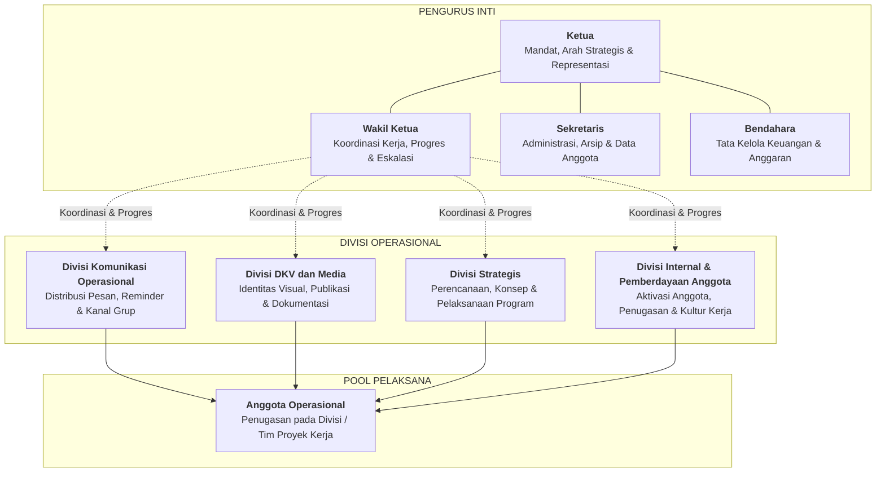
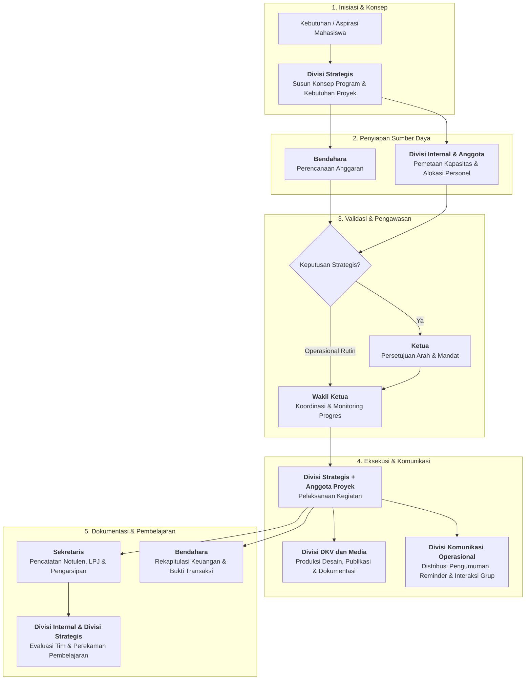

# Struktur dan Peran HIMA

## 1. Tujuan

Dokumen ini menetapkan rancangan struktur kerja HIMA yang ramping, berbasis fungsi, dan dapat dijalankan dengan kapasitas anggota yang masih berkembang.

Rancangan ini disusun untuk menjawab masalah yang teridentifikasi pada diagnosis awal: komunikasi tidak berjalan konsisten, publikasi tidak aktif, organisasi cenderung reaktif, tugas tidak memiliki pemilik yang jelas, serta anggota belum terkelola dan terlibat secara terarah.

Dokumen ini menetapkan fungsi dan batas tanggung jawab. Penempatan nama personel, jumlah anggota per divisi, dan prosedur operasional rinci ditetapkan pada dokumen terpisah.

## 2. Prinsip Struktur

- Fungsi lebih penting daripada banyaknya jabatan.
- Tidak ada fungsi kritis yang boleh kosong hanya karena belum ada divisi besar.
- Struktur harus ramping dan dapat dijalankan oleh anggota yang tersedia.
- Perangkapan fungsi diperbolehkan sementara, tetapi tanggung jawab tetap harus jelas.
- Setiap pekerjaan harus memiliki pemilik, keluaran, dan jalur eskalasi.
- Pengurus inti menjaga mandat, koordinasi, administrasi, dan keuangan.
- Divisi menjaga fungsi operasional organisasi.
- Anggota operasional ditempatkan pada divisi atau proyek berdasarkan kebutuhan, kapasitas, dan minat.
- Program tidak berdiri sebagai divisi tersendiri. Perencanaan hingga pelaksanaan program merupakan mandat Divisi Strategis dengan dukungan divisi lain dan anggota operasional.

## 3. Bentuk Struktur



```text
Ketua
Wakil Ketua
Sekretaris
Bendahara

Divisi Operasional
- Divisi Komunikasi Operasional
- Divisi DKV dan Media
- Divisi Strategis
- Divisi Internal dan Pemberdayaan Anggota

Anggota Operasional
- Ditempatkan pada divisi atau ditugaskan pada proyek sesuai kebutuhan
```

Keempat pengurus inti bekerja sebagai satu kepengurusan.

Kepala divisi bertanggung jawab kepada Ketua dan Wakil Ketua sesuai jalur koordinasi yang ditetapkan. Anggota operasional bertanggung jawab kepada kepala divisi atau koordinator proyek yang menugaskannya.

## 4. Pengurus Inti

### Ketua

**Mandat:** Memegang arah, mandat organisasi, keputusan strategis, dan representasi formal HIMA.

**Tanggung jawab:**

- Menjaga agar kegiatan dan keputusan selaras dengan mandat HIMA.
- Mengambil keputusan strategis dan menyelesaikan isu yang tidak dapat diputuskan pada tingkat divisi.
- Menjadi representasi formal HIMA kepada Program Studi, kampus, organisasi lain, dan mitra strategis.
- Menyetujui arah program, prioritas, serta keputusan penting organisasi.
- Memastikan akuntabilitas akhir atas kinerja kepengurusan.

**Bukan mandat utama:**

- Mengerjakan seluruh tugas operasional.
- Menjadi satu-satunya penghubung komunikasi.
- Menggantikan fungsi kepala divisi.

### Wakil Ketua

**Mandat:** Menjaga koordinasi kerja, progres lintas divisi, dan tindak lanjut kepengurusan.

**Tanggung jawab:**

- Mengoordinasikan kepala divisi dan membantu menyelesaikan hambatan lintas divisi.
- Memastikan hasil rapat berubah menjadi penugasan, tenggat, dan tindak lanjut.
- Memantau progres kerja periodik serta mengeskalasi pekerjaan yang macet kepada Ketua.
- Menjadi pengganti Ketua apabila Ketua berhalangan.
- Bekerja bersama Divisi Internal dan Pemberdayaan Anggota untuk menjaga keterlibatan anggota.

**Bukan mandat utama:**

- Mengambil alih seluruh tugas kepala divisi.
- Menjadi satu-satunya pelaksana program.

### Sekretaris

**Mandat:** Memegang administrasi, memori organisasi, dan kebenaran dokumentasi resmi.

**Tanggung jawab:**

- Mengelola struktur kepengurusan, daftar anggota, status keanggotaan, dan data kontak kerja.
- Menyusun dan menyimpan notulen, surat, keputusan, agenda, serta arsip resmi.
- Menjaga repositori atau penyimpanan dokumen agar informasi organisasi dapat ditemukan.
- Mencatat keputusan, penugasan penting, dan perubahan struktur.
- Mendukung kebutuhan administrasi program dan kegiatan.

**Bukan mandat utama:**

- Membuat desain publikasi.
- Menjadi pemilik seluruh komunikasi di grup.

### Bendahara

**Mandat:** Memegang tata kelola keuangan dan kebenaran catatan finansial organisasi.

**Tanggung jawab:**

- Mengelola kas, anggaran, pemasukan, pengeluaran, dan bukti transaksi.
- Menyiapkan perencanaan anggaran untuk kegiatan bersama Divisi Strategis dan pihak terkait.
- Menyimpan catatan keuangan serta menyusun laporan keuangan periodik.
- Memberikan informasi kondisi anggaran untuk mendukung keputusan organisasi.
- Menjaga penggunaan dana tetap dapat dipertanggungjawabkan.

**Bukan mandat utama:**

- Memutuskan sendiri prioritas program.
- Menanggung biaya tanpa persetujuan yang berlaku.

## 5. Divisi Operasional

### Divisi Komunikasi Operasional

**Mandat:** Memastikan informasi organisasi diteruskan secara cepat, jelas, tepat sasaran, dan dapat ditindaklanjuti.

**Masalah yang dijawab:** Informasi dan reminder tidak berjalan konsisten sehingga komunikasi dapat diambil alih oleh pihak di luar HIMA.

**Tanggung jawab:**

- Meneruskan pengumuman, informasi kegiatan, dan pesan resmi melalui kanal yang ditetapkan.
- Menjalankan reminder terhadap agenda, tenggat, rapat, pendaftaran, dan kebutuhan partisipasi.
- Mengelola grup atau kanal komunikasi operasional bersama pengurus yang berwenang.
- Memastikan informasi memuat tujuan, sasaran, tindakan yang diminta, tenggat, dan kontak penanggung jawab.
- Mengumpulkan pertanyaan umum serta meneruskannya kepada pihak yang tepat.
- Mencatat informasi penting yang perlu diarsipkan bersama Sekretaris.

**Batas peran:** Divisi ini mengelola distribusi dan tindak lanjut informasi. Desain visual dan produksi konten berada pada Divisi DKV dan Media.

### Divisi DKV dan Media

**Mandat:** Membangun visibilitas HIMA melalui identitas visual, publikasi digital, dan dokumentasi media.

**Masalah yang dijawab:** Sosial media tidak aktif, publikasi tidak jelas, dan keberadaan HIMA tidak terlihat secara konsisten.

**Tanggung jawab:**

- Membuat desain sertifikat, poster, banner, materi pengumuman, ucapan hari raya, dan kebutuhan visual organisasi.
- Mengelola kalender konten, unggahan media sosial, serta publikasi digital HIMA.
- Mendokumentasikan kegiatan dalam bentuk foto, video, atau materi visual sesuai kebutuhan.
- Menjaga identitas visual, kualitas komunikasi publik, dan arsip materi publikasi.
- Berkoordinasi dengan Divisi Komunikasi Operasional agar informasi yang dipublikasikan akurat dan tepat waktu.

**Batas peran:** Divisi ini memproduksi dan mengelola media. Keputusan substansi program berada pada Divisi Strategis, sedangkan distribusi pengumuman operasional berada pada Divisi Komunikasi Operasional.

### Divisi Strategis

**Mandat:** Menentukan arah program dan strategi HIMA, lalu mengelola perencanaan sampai pelaksanaan program.

**Masalah yang dijawab:** Organisasi bergerak reaktif, tidak memiliki arah program yang jelas, dan kegiatan tidak berjalan mandiri.

**Tanggung jawab:**

- Memetakan kebutuhan mahasiswa, peluang, masalah, dan prioritas organisasi.
- Menyusun arah program, konsep kegiatan, target, serta ukuran hasil yang relevan.
- Menentukan kebutuhan proyek: ruang lingkup, jadwal, personel, anggaran, risiko, dan kebutuhan komunikasi.
- Mengelola pelaksanaan program atau menunjuk koordinator proyek ketika diperlukan.
- Berkoordinasi dengan Divisi Internal dan Pemberdayaan Anggota untuk kebutuhan personel serta pembagian tugas.
- Berkoordinasi dengan Bendahara untuk perencanaan anggaran.
- Berkoordinasi dengan Divisi Komunikasi Operasional untuk penyebaran informasi.
- Berkoordinasi dengan Divisi DKV dan Media untuk publikasi dan dokumentasi.
- Mengevaluasi hasil program dan mencatat pembelajaran bersama Sekretaris.

**Batas peran:** Divisi Strategis memegang arah dan manajemen program, tetapi tidak harus menjadi pelaksana tunggal seluruh tugas teknis.

### Divisi Internal dan Pemberdayaan Anggota

**Mandat:** Memastikan anggota teridentifikasi, terlibat, mendapat penugasan yang jelas, dan berkembang sebagai bagian dari organisasi.

**Masalah yang dijawab:** Anggota dan tingkat keterlibatannya tidak jelas, pembagian tugas lemah, serta organisasi minim aksi karena personel tidak teraktivasi secara terarah.

**Tanggung jawab:**

- Bekerja bersama Sekretaris untuk menjaga daftar anggota, status keterlibatan, kapasitas, minat, dan ketersediaan anggota.
- Mengaktifkan anggota melalui komunikasi internal, orientasi kerja dasar, dan keterlibatan dalam divisi atau proyek.
- Membantu pembagian tugas anggota berdasarkan kebutuhan program, kapasitas, dan minat.
- Memantau keterlibatan anggota, mengidentifikasi hambatan, serta menyampaikan kebutuhan dukungan kepada Wakil Ketua.
- Membantu evaluasi kontribusi dan perkembangan anggota secara periodik.
- Mendorong budaya kerja yang saling menghormati, dapat diandalkan, dan bertanggung jawab.

**Batas peran:** Divisi ini mengelola keterlibatan dan penugasan anggota. Keputusan arah program tetap berada pada Divisi Strategis, sedangkan koordinasi kinerja lintas divisi berada pada Wakil Ketua.

## 6. Anggota Operasional

Anggota operasional adalah anggota organisasi yang mendukung pelaksanaan kerja divisi dan proyek. Istilah ini digunakan untuk menegaskan bahwa setiap anggota mempunyai kontribusi nyata tanpa harus memegang jabatan pengurus inti atau kepala divisi.

**Tanggung jawab:**

- Mengikuti penempatan pada divisi atau penugasan proyek yang disepakati.
- Menyelesaikan tugas sesuai ruang lingkup dan tenggat yang diberikan.
- Menyampaikan hambatan lebih awal kepada kepala divisi atau koordinator proyek.
- Menjaga komunikasi, etika kerja, dan akuntabilitas terhadap tugas.
- Berpartisipasi dalam evaluasi serta pembelajaran organisasi.

## 7. Alur Kerja Lintas Fungsi



1. Divisi Strategis mengidentifikasi kebutuhan dan menetapkan rancangan program atau proyek.
2. Divisi Internal dan Pemberdayaan Anggota membantu menyiapkan serta membagi personel sesuai kebutuhan.
3. Divisi Strategis mengoordinasikan pelaksanaan bersama anggota operasional dan divisi pendukung.
4. Divisi Komunikasi Operasional menyebarkan informasi, reminder, dan tindak lanjut kepada sasaran yang tepat.
5. Divisi DKV dan Media menyiapkan materi visual, publikasi, serta dokumentasi kegiatan.
6. Sekretaris mencatat keputusan, penugasan penting, dan arsip hasil.
7. Bendahara mengelola kebutuhan dan catatan keuangan.
8. Wakil Ketua memantau progres lintas fungsi.
9. Ketua mengambil keputusan atau eskalasi yang bersifat strategis.

## 8. Ketentuan Kapasitas dan Perangkapan

- Struktur ini menetapkan fungsi minimum, bukan kewajiban untuk langsung memiliki banyak jabatan atau kepala divisi.
- Jika SDM belum cukup, satu orang dapat memegang lebih dari satu fungsi selama penugasan, batas tanggung jawab, dan kapasitasnya dicatat secara terbuka.
- Perangkapan yang paling mungkin pada fase awal adalah Divisi Komunikasi Operasional dengan Divisi DKV dan Media.
- Wakil Ketua dapat mendampingi fungsi Divisi Internal dan Pemberdayaan Anggota hingga terdapat penanggung jawab khusus.
- Perangkapan tidak boleh menghapus kewajiban fungsi.
- Pekerjaan yang tidak mampu ditangani harus dieskalasi, disederhanakan, atau dijadwalkan ulang secara terbuka.

## 9. Batas Dokumen

Dokumen ini tidak mengatur tata cara rekrutmen, onboarding, SOP teknis, standar desain, alur persuratan, prosedur keuangan, maupun detail program kerja.

Ketentuan tersebut disusun pada folder dan dokumen terpisah setelah struktur serta mandat peran ini disepakati.
