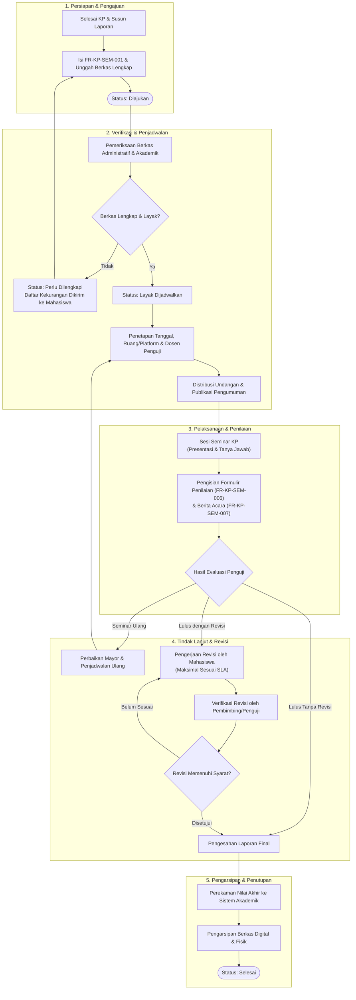
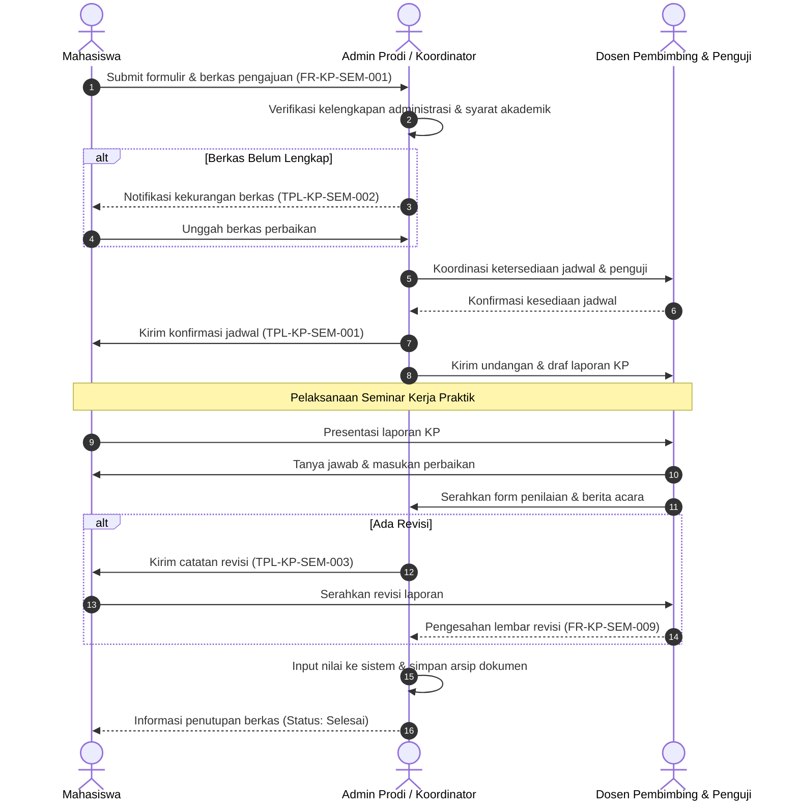
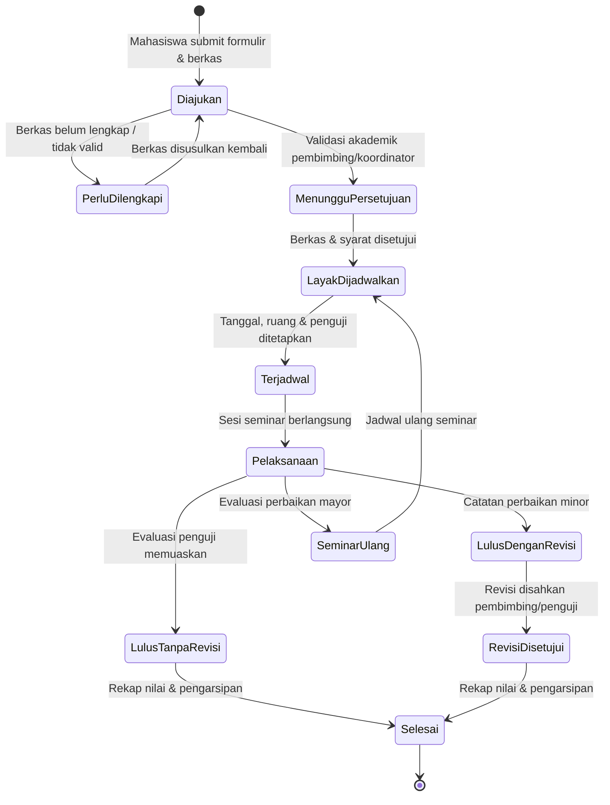

# SOP Seminar Kerja Praktik (KP)

**Kode dokumen:** SOP-KP-SEM-001  
**Versi:** 0.1 — Draf Acuan Pembaruan  
**Status:** Draf untuk penyesuaian dengan ketentuan Program Studi  
**Pemilik proses:** Program Studi `{{NAMA_PROGRAM_STUDI}}`  
**Tanggal berlaku:** `{{YYYY-MM-DD}}`  
**Tanggal tinjau ulang:** `{{YYYY-MM-DD}}`

> **Catatan penggunaan**  
> Dokumen ini adalah template/acuan proses. Semua persyaratan akademik, istilah jabatan, jumlah seminar yang wajib dihadiri, format laporan, durasi presentasi, formulir, serta pihak yang berwenang harus disesuaikan dengan kebijakan resmi Program Studi/Fakultas/Universitas sebelum ditetapkan.

---

## 1. Tujuan

SOP ini mengatur proses pengajuan, persiapan, pelaksanaan, penilaian, perbaikan, dan pengarsipan Seminar Kerja Praktik (KP) agar berjalan tertib, terdokumentasi, transparan, dan konsisten.

## 2. Ruang Lingkup

SOP ini berlaku bagi:

- Mahasiswa Program Studi `{{NAMA_PROGRAM_STUDI}}` yang telah menyelesaikan pelaksanaan Kerja Praktik.
- Dosen Pembimbing Kerja Praktik.
- Dosen Penguji/Penilai Seminar Kerja Praktik.
- Koordinator Kerja Praktik atau pihak yang ditunjuk.
- Admin Program Studi/Tata Usaha.
- Moderator, notulis, atau panitia seminar apabila ditetapkan.

Proses yang dicakup meliputi:

1. Kelayakan dan pengajuan seminar KP.
2. Verifikasi persyaratan administrasi dan akademik.
3. Penetapan jadwal, ruangan/media, serta penguji.
4. Distribusi pengumuman atau undangan seminar.
5. Pelaksanaan seminar dan penilaian.
6. Revisi laporan dan tindak lanjut hasil seminar.
7. Pengarsipan dokumen dan pembaruan status KP mahasiswa.

## 3. Definisi dan Singkatan

| Istilah | Definisi |
|---|---|
| KP | Kerja Praktik, kegiatan akademik mahasiswa pada instansi/perusahaan/lembaga sesuai ketentuan Program Studi |
| Seminar KP | Presentasi terbuka atau terbatas atas hasil Kerja Praktik mahasiswa yang dilaksanakan setelah persyaratan dipenuhi |
| Mahasiswa | Mahasiswa aktif yang mengajukan Seminar KP |
| Pembimbing | Dosen pembimbing Kerja Praktik yang membimbing laporan dan/atau pelaksanaan KP |
| Penguji/Penilai | Dosen atau pihak yang ditunjuk untuk menilai pelaksanaan Seminar KP |
| Koordinator KP | Dosen/staf yang ditunjuk untuk mengelola kebijakan dan administrasi Kerja Praktik |
| Admin Prodi | Pihak administrasi yang memeriksa berkas, mengelola jadwal, dan mengarsipkan dokumen |
| Berita Acara | Dokumen resmi yang mencatat pelaksanaan seminar, hasil, catatan, dan keputusan |
| Revisi | Perbaikan laporan atau materi berdasarkan masukan pembimbing/penguji |

## 4. Prinsip Pelaksanaan

- **Kepatuhan akademik:** Semua persyaratan mengikuti ketentuan resmi Program Studi/Fakultas.
- **Kesiapan dokumen:** Seminar hanya dijadwalkan setelah berkas dinyatakan lengkap dan layak.
- **Kejelasan peran:** Setiap tahap memiliki penanggung jawab dan keluaran yang terdokumentasi.
- **Ketepatan waktu:** Mahasiswa, pembimbing, penguji, dan admin mengikuti tenggat yang ditetapkan.
- **Transparansi hasil:** Nilai, catatan revisi, dan status kelulusan dicatat melalui dokumen/formulir resmi.
- **Pengarsipan:** Dokumen seminar disimpan sesuai kebijakan retensi data Program Studi.

## 5. Pihak Terkait dan Tanggung Jawab

| Pihak | Tanggung jawab |
|---|---|
| Mahasiswa | Memenuhi persyaratan, mengajukan seminar, menyiapkan materi, hadir tepat waktu, menerima masukan, dan menyelesaikan revisi |
| Dosen Pembimbing KP | Membimbing mahasiswa, menilai kesiapan laporan, memberi persetujuan sesuai ketentuan, dan memeriksa revisi |
| Koordinator KP | Menetapkan atau mengawasi ketentuan seminar, membantu penyelesaian kendala, dan memastikan proses berjalan sesuai SOP |
| Admin Prodi | Menerima berkas, memverifikasi kelengkapan administratif, membantu penjadwalan, menyebarkan pengumuman, dan mengarsipkan dokumen |
| Penguji/Penilai | Menghadiri seminar, memberi penilaian dan masukan, serta menandatangani dokumen penilaian bila ditetapkan |
| Moderator/Panitia | Menjaga kelancaran sesi seminar, waktu, daftar hadir, dokumentasi, dan teknis ruang/platform bila ditugaskan |

## 6. Ketentuan Umum

### 6.1 Kelayakan mahasiswa

Mahasiswa dapat mengajukan Seminar KP setelah memenuhi ketentuan berikut sesuai kebijakan resmi Program Studi:

- [ ] Telah menyelesaikan pelaksanaan KP pada instansi/perusahaan/lembaga.
- [ ] Memiliki bukti pelaksanaan KP atau dokumen pendukung dari instansi, apabila dipersyaratkan.
- [ ] Telah menyusun laporan KP sesuai pedoman penulisan yang berlaku.
- [ ] Telah memperoleh persetujuan atau rekomendasi dari Dosen Pembimbing KP, apabila dipersyaratkan.
- [ ] Telah memenuhi syarat kehadiran seminar KP mahasiswa lain, apabila dipersyaratkan.
- [ ] Telah memenuhi ketentuan administrasi dan akademik lain yang berlaku.

### 6.2 Kelengkapan pengajuan

Berkas pengajuan minimal dapat mencakup:

- Formulir pengajuan Seminar KP.
- Laporan KP versi sesuai ketentuan, dalam bentuk digital dan/atau cetak.
- Lembar persetujuan pembimbing, bila dipersyaratkan.
- Bukti pelaksanaan KP atau surat keterangan dari instansi, bila dipersyaratkan.
- Bukti kehadiran seminar KP, bila dipersyaratkan.
- Bukti bebas administrasi atau dokumen pendukung lain sesuai kebijakan.
- Materi presentasi atau tautan file, apabila diminta sebelum seminar.

### 6.3 Batas pengajuan

- Pengajuan diajukan paling lambat `{{JUMLAH_HARI}}` hari kerja sebelum tanggal seminar yang diusulkan.
- Pengajuan yang belum lengkap tidak diproses untuk penjadwalan sampai kelengkapan dipenuhi.
- Perubahan jadwal yang diajukan mahasiswa harus disertai alasan dan diajukan paling lambat `{{JUMLAH_HARI}}` hari kerja sebelum jadwal, kecuali keadaan darurat yang dapat dibuktikan.

### 6.4 Format dan durasi seminar

| Komponen | Ketentuan |
|---|---|
| Moda pelaksanaan | Luring/daring/hibrida sesuai penetapan Program Studi |
| Durasi presentasi | `{{DURASI_PRESENTASI}}` menit |
| Durasi tanya jawab | `{{DURASI_TANYA_JAWAB}}` menit |
| Durasi total | `{{DURASI_TOTAL}}` menit |
| Format materi | Mengikuti template/pedoman Program Studi |
| Kehadiran | Mahasiswa wajib hadir tepat waktu selama seluruh sesi |
| Dokumentasi | Sesuai ketentuan Program Studi dan persetujuan peserta |

## 7. Prosedur

### 7.1 Ringkasan alur



#### Diagram Interaksi Antar-Peran



### 7.2 Tahap 1 — Persiapan oleh mahasiswa

1. Mahasiswa menyelesaikan pelaksanaan KP sesuai ketentuan yang berlaku.
2. Mahasiswa menyusun laporan KP dan materi presentasi berdasarkan pedoman Program Studi.
3. Mahasiswa berkonsultasi dengan Dosen Pembimbing KP sesuai kebutuhan.
4. Mahasiswa memastikan seluruh persyaratan administrasi dan akademik telah dipenuhi.

**Keluaran:** Laporan KP, materi presentasi, dan berkas pengajuan yang siap diperiksa.

### 7.3 Tahap 2 — Pengajuan Seminar KP

1. Mahasiswa mengisi `FR-KP-SEM-001 — Formulir Pengajuan Seminar KP`.
2. Mahasiswa menyerahkan atau mengunggah seluruh berkas pengajuan melalui kanal yang ditetapkan.
3. Mahasiswa menerima tanda terima atau nomor pengajuan, jika sistem mendukung.
4. Admin Prodi mencatat pengajuan pada log Seminar KP.

**Status pengajuan:** `Diajukan`.

### 7.4 Tahap 3 — Verifikasi kelengkapan

1. Admin Prodi memeriksa kelengkapan administratif berdasarkan checklist.
2. Koordinator KP dan/atau Dosen Pembimbing memeriksa kelayakan akademik sesuai kewenangannya.
3. Jika berkas belum lengkap atau belum layak, mahasiswa menerima daftar kekurangan/perbaikan.
4. Mahasiswa melengkapi dan mengajukan kembali berkas yang diperlukan.

**Status pengajuan:**

- `Perlu dilengkapi`, jika ada dokumen atau syarat yang belum terpenuhi.
- `Menunggu persetujuan`, jika kelengkapan ada tetapi membutuhkan persetujuan pembimbing/koordinator.
- `Layak dijadwalkan`, jika semua persyaratan telah dipenuhi.

### 7.5 Tahap 4 — Penetapan jadwal dan penguji

1. Koordinator KP/Admin Prodi mengusulkan atau menetapkan jadwal seminar berdasarkan ketersediaan pembimbing, penguji, ruangan/platform, dan slot seminar.
2. Pihak berwenang menetapkan dosen penguji/penilai sesuai ketentuan.
3. Admin Prodi mengonfirmasi jadwal kepada mahasiswa, pembimbing, dan penguji.
4. Jadwal final dicatat pada log Seminar KP.
5. Bila ada konflik jadwal, perubahan dilakukan dengan persetujuan pihak terkait dan dicatat sebagai revisi jadwal.

**Keluaran:** Jadwal final, daftar pembimbing/penguji, serta informasi ruang/platform.

### 7.6 Tahap 5 — Pengumuman dan undangan

1. Admin Prodi atau pihak yang ditunjuk menyiapkan pengumuman/undangan Seminar KP.
2. Pengumuman memuat minimal nama mahasiswa, judul/topik KP, tanggal, waktu, lokasi/platform, serta ketentuan kehadiran bila ada.
3. Undangan kepada pembimbing, penguji, dan pihak terkait disampaikan melalui kanal resmi.
4. Mahasiswa memastikan materi presentasi dan kebutuhan teknis tersedia sebelum seminar.

**Keluaran:** Pengumuman/undangan seminar dan kesiapan teknis.

### 7.7 Tahap 6 — Pelaksanaan Seminar KP

1. Moderator/panitia memverifikasi kehadiran mahasiswa, pembimbing, penguji, dan peserta sesuai ketentuan.
2. Moderator membuka sesi dan menjelaskan susunan acara.
3. Mahasiswa mempresentasikan hasil KP dalam durasi yang telah ditetapkan.
4. Pembimbing, penguji, atau peserta memberikan pertanyaan dan masukan.
5. Penguji/penilai mengisi formulir penilaian sesuai komponen yang ditetapkan.
6. Moderator menutup sesi dan menyampaikan tindak lanjut umum.
7. Berita acara, daftar hadir, dan dokumen penilaian dikumpulkan.

**Keluaran:** Seminar terlaksana, formulir penilaian, daftar hadir, dan berita acara.

### 7.8 Tahap 7 — Penilaian dan penetapan hasil

1. Penguji/penilai menyerahkan nilai dan catatan perbaikan melalui formulir resmi.
2. Koordinator KP/Admin Prodi merekap hasil sesuai ketentuan Program Studi.
3. Hasil seminar ditetapkan sebagai salah satu status berikut:

| Status hasil | Keterangan |
|---|---|
| `Lulus tanpa revisi` | Seminar dinyatakan lulus dan tidak ada revisi substansial |
| `Lulus dengan revisi` | Seminar dinyatakan lulus dengan kewajiban menyelesaikan revisi |
| `Seminar ulang/perbaikan mayor` | Mahasiswa wajib melakukan perbaikan substansial dan/atau mengikuti seminar ulang sesuai keputusan |
| `Belum ditetapkan` | Hasil menunggu kelengkapan atau keputusan pihak berwenang |

4. Mahasiswa menerima hasil, nilai bila dapat disampaikan, serta daftar revisi/tindak lanjut.

### 7.9 Tahap 8 — Revisi dan verifikasi

1. Mahasiswa memperbaiki laporan atau materi sesuai catatan penguji/pembimbing.
2. Mahasiswa menyerahkan hasil revisi sebelum tenggat `{{TENGGAT_REVISI}}`.
3. Dosen Pembimbing dan/atau Penguji memverifikasi revisi sesuai kewenangannya.
4. Jika revisi belum memenuhi, mahasiswa menerima catatan tambahan dan melakukan perbaikan kembali.
5. Setelah revisi disetujui, status diubah menjadi `Revisi disetujui`.

**Keluaran:** Laporan KP final yang telah disetujui sesuai ketentuan.

### 7.10 Tahap 9 — Pengarsipan dan penutupan

1. Admin Prodi mengarsipkan formulir pengajuan, persetujuan, jadwal, undangan, daftar hadir, penilaian, berita acara, dan laporan final sesuai kebijakan.
2. Nilai/status KP diperbarui pada sistem akademik atau log internal sesuai prosedur yang berlaku.
3. Status pengajuan diubah menjadi `Selesai`.
4. Dokumen disimpan selama periode retensi yang ditetapkan Program Studi/Fakultas/Universitas.

## 8. Target Waktu Layanan

| Aktivitas | Target waktu | Penanggung jawab |
|---|---:|---|
| Pencatatan pengajuan | Maksimal `{{SLA}}` hari kerja setelah berkas diterima | Admin Prodi |
| Verifikasi kelengkapan | Maksimal `{{SLA}}` hari kerja | Admin Prodi/Koordinator KP |
| Pemberitahuan kekurangan berkas | Maksimal `{{SLA}}` hari kerja setelah verifikasi | Admin Prodi |
| Penetapan jadwal setelah layak | Maksimal `{{SLA}}` hari kerja atau sesuai slot yang tersedia | Koordinator KP/Admin Prodi |
| Pengiriman undangan/pengumuman | Minimal `{{SLA}}` hari kerja sebelum seminar | Admin Prodi/Panitia |
| Rekap hasil seminar | Maksimal `{{SLA}}` hari kerja setelah seminar | Koordinator KP/Admin Prodi |
| Pengajuan revisi oleh mahasiswa | Maksimal `{{TENGGAT_REVISI}}` setelah seminar | Mahasiswa |
| Verifikasi revisi | Maksimal `{{SLA}}` hari kerja setelah revisi diterima | Pembimbing/Penguji |
| Pengarsipan akhir | Maksimal `{{SLA}}` hari kerja setelah revisi disetujui | Admin Prodi |

## 9. Dokumen dan Formulir Terkait

| Kode | Nama dokumen/formulir | Kegunaan |
|---|---|---|
| `FR-KP-SEM-001` | Formulir Pengajuan Seminar KP | Pengajuan formal oleh mahasiswa |
| `FR-KP-SEM-002` | Checklist Kelengkapan Pengajuan | Verifikasi administrasi dan persyaratan |
| `FR-KP-SEM-003` | Lembar Persetujuan Pembimbing | Bukti persetujuan/rekomendasi pembimbing bila diperlukan |
| `FR-KP-SEM-004` | Surat/Undangan Seminar KP | Pemberitahuan kepada pembimbing, penguji, dan pihak terkait |
| `FR-KP-SEM-005` | Daftar Hadir Seminar KP | Bukti kehadiran peserta dan pihak terkait |
| `FR-KP-SEM-006` | Formulir Penilaian Seminar KP | Penilaian oleh penguji/penilai |
| `FR-KP-SEM-007` | Berita Acara Seminar KP | Catatan pelaksanaan dan keputusan hasil seminar |
| `FR-KP-SEM-008` | Lembar Catatan Revisi | Rincian revisi yang harus dikerjakan mahasiswa |
| `FR-KP-SEM-009` | Lembar Verifikasi Revisi | Bukti revisi telah diperiksa dan disetujui |
| `LG-KP-SEM-001` | Log Pengajuan dan Jadwal Seminar KP | Rekaman status pengajuan, jadwal, PIC, dan hasil |
| `TPL-KP-SEM-001` | Template Pengumuman Seminar KP | Format komunikasi publik/internal |
| `TPL-KP-SEM-002` | Template Pemberitahuan Kekurangan Berkas | Format komunikasi perbaikan pengajuan |
| `TPL-KP-SEM-003` | Template Pemberitahuan Hasil Seminar | Format penyampaian hasil dan tindak lanjut |

## 10. Checklist Pengajuan Seminar KP

| No. | Item pemeriksaan | Ada | Valid | Catatan |
|---:|---|:---:|:---:|---|
| 1 | Formulir pengajuan Seminar KP | [ ] | [ ] | |
| 2 | Laporan KP sesuai format | [ ] | [ ] | |
| 3 | Persetujuan pembimbing, bila dipersyaratkan | [ ] | [ ] | |
| 4 | Bukti pelaksanaan KP | [ ] | [ ] | |
| 5 | Bukti kehadiran seminar, bila dipersyaratkan | [ ] | [ ] | |
| 6 | Materi presentasi, bila dipersyaratkan | [ ] | [ ] | |
| 7 | Dokumen administrasi lain | [ ] | [ ] | |
| 8 | Informasi kontak mahasiswa benar | [ ] | [ ] | |

## 11. Template Komunikasi

### 11.1 Pemberitahuan berkas belum lengkap

```text
Subjek: Kelengkapan Pengajuan Seminar KP — {{NAMA_MAHASISWA}}

Halo, {{NAMA_MAHASISWA}}.

Berdasarkan pemeriksaan awal, pengajuan Seminar Kerja Praktik Anda belum dapat diproses karena masih terdapat dokumen/informasi yang perlu dilengkapi:

1. {{KEKURANGAN_1}}
2. {{KEKURANGAN_2}}
3. {{KEKURANGAN_3}}

Mohon melengkapi berkas melalui {{KANAL_PENGUMPULAN}} paling lambat {{TENGGAT}}.
Setelah lengkap, pengajuan akan diproses untuk tahap penjadwalan.

Terima kasih.
{{NAMA_ADMIN_ATAU_KOORDINATOR}}
{{UNIT}}
```

### 11.2 Konfirmasi jadwal seminar

```text
Subjek: Konfirmasi Jadwal Seminar Kerja Praktik — {{NAMA_MAHASISWA}}

Halo, {{NAMA_MAHASISWA}}.

Pengajuan Seminar Kerja Praktik Anda telah dijadwalkan sebagai berikut:

Nama: {{NAMA_MAHASISWA}}
NIM: {{NIM}}
Judul/Topik KP: {{JUDUL}}
Hari/Tanggal: {{TANGGAL}}
Waktu: {{WAKTU}}
Lokasi/Platform: {{LOKASI_ATAU_TAUTAN}}
Pembimbing: {{NAMA_PEMBIMBING}}
Penguji/Penilai: {{NAMA_PENGUJI}}

Mohon hadir/bergabung paling lambat {{WAKTU_HADIR}} dan menyiapkan materi presentasi sesuai ketentuan.

Jika terdapat kendala yang mendesak, hubungi {{KONTAK}}.
```

### 11.3 Pengumuman seminar

```text
[SEMINAR KERJA PRAKTIK]

Akan dilaksanakan Seminar Kerja Praktik oleh:

Nama: {{NAMA_MAHASISWA}}
NIM: {{NIM}}
Judul/Topik: {{JUDUL}}

📅 Hari/Tanggal: {{TANGGAL}}
🕒 Waktu: {{WAKTU}}
📍 Lokasi/Platform: {{LOKASI_ATAU_TAUTAN}}

{{KETENTUAN_KEHADIRAN_JIKA_ADA}}

Informasi lebih lanjut:
{{KONTAK_ATAU_SUMBER}}
```

### 11.4 Pemberitahuan hasil dan revisi

```text
Subjek: Hasil Seminar Kerja Praktik — {{NAMA_MAHASISWA}}

Halo, {{NAMA_MAHASISWA}}.

Berdasarkan Seminar Kerja Praktik pada {{TANGGAL_SEMINAR}}, hasil Anda adalah:

Status: {{STATUS_HASIL}}
Catatan/tindak lanjut:
{{CATATAN_REVISI}}

Mohon menyerahkan hasil revisi melalui {{KANAL_PENGUMPULAN}} paling lambat {{TENGGAT_REVISI}}.

Jika tidak ada revisi, silakan lanjutkan prosedur penyerahan laporan akhir sesuai ketentuan Program Studi.

Terima kasih.
{{NAMA_ADMIN_ATAU_KOORDINATOR}}
```

## 12. Log Pengajuan dan Jadwal Seminar KP

### 12.1 Siklus Hidup Status Pengajuan



### 12.2 Struktur Data Log

| Kolom | Keterangan |

|---|---|
| `seminar_id` | ID unik seminar, misalnya `KP-SEM-2026-001` |
| `tanggal_pengajuan` | Tanggal/jam pengajuan diterima |
| `nim` | Nomor induk mahasiswa |
| `nama_mahasiswa` | Nama mahasiswa |
| `judul_kp` | Judul atau topik KP |
| `pembimbing` | Nama pembimbing |
| `penguji` | Nama penguji/penilai |
| `status` | Status proses saat ini |
| `kekurangan_berkas` | Dokumen yang perlu dilengkapi bila ada |
| `tanggal_seminar` | Jadwal seminar final |
| `waktu_seminar` | Waktu seminar |
| `lokasi_platform` | Ruang atau tautan platform |
| `hasil` | Status hasil seminar |
| `tenggat_revisi` | Batas penyerahan revisi |
| `tanggal_verifikasi_revisi` | Tanggal revisi disetujui |
| `link_arsip` | Lokasi dokumen digital sesuai hak akses |
| `catatan` | Catatan tambahan |

Contoh entri:

| seminar_id | tanggal_pengajuan | nim | nama_mahasiswa | judul_kp | status | tanggal_seminar | hasil | tenggat_revisi | catatan |
|---|---|---|---|---|---|---|---|---|---|
| KP-SEM-2026-001 | 2026-09-14 09:00 | `{{NIM}}` | `{{NAMA}}` | `{{JUDUL_KP}}` | Layak dijadwalkan | `{{YYYY-MM-DD}}` | Belum ditetapkan | `{{YYYY-MM-DD}}` | |

## 13. Rekaman dan Pengarsipan

| Rekaman | Penyimpan | Media | Retensi | Akses |
|---|---|---|---|---|
| Formulir pengajuan | Admin Prodi | Sistem/drive/arsip fisik resmi | Sesuai kebijakan institusi | Petugas berwenang |
| Laporan KP | Program Studi | Repositori/drive resmi | Sesuai kebijakan institusi | Sesuai aturan akses akademik |
| Jadwal dan undangan | Admin Prodi | Sistem/drive resmi | Sesuai kebijakan institusi | Pihak terkait |
| Daftar hadir dan berita acara | Admin Prodi/Koordinator KP | Arsip resmi | Sesuai kebijakan institusi | Petugas berwenang |
| Formulir penilaian dan revisi | Koordinator KP/Admin Prodi | Arsip resmi | Sesuai kebijakan institusi | Pihak berwenang |

## 14. Ketidaksesuaian dan Eskalasi

| Kondisi | Tindakan awal | Eskalasi |
|---|---|---|
| Berkas tidak lengkap | Kembalikan kepada mahasiswa dengan daftar kekurangan | Koordinator KP bila berulang atau ada ketidakjelasan syarat |
| Pembimbing/penguji berhalangan | Jadwalkan ulang atau tunjuk pengganti sesuai ketentuan | Koordinator KP/Kaprodi |
| Gangguan teknis saat seminar daring | Catat kejadian dan lanjutkan/jadwalkan ulang sesuai keputusan | Koordinator KP/Admin Prodi |
| Mahasiswa tidak hadir | Catat pada berita acara dan tentukan tindak lanjut sesuai ketentuan | Koordinator KP/Kaprodi |
| Perselisihan hasil/prosedur | Dokumentasikan keberatan dan arahkan ke mekanisme akademik yang berlaku | Koordinator KP/Kaprodi/Fakultas |
| Dugaan pelanggaran akademik | Hentikan proses sesuai kebutuhan dan simpan bukti | Pihak berwenang sesuai kebijakan akademik |

## 15. Riwayat Revisi

| Versi | Tanggal | Perubahan | Penyusun | Pemeriksa | Penyetuju |
|---|---|---|---|---|---|
| 0.1 | `{{YYYY-MM-DD}}` | Draf awal acuan SOP Seminar Kerja Praktik | `{{NAMA}}` | `{{NAMA}}` | `{{NAMA}}` |
