# SOP Siklus Awal Semester — Meta-SOP Koordinasi H-14

**Kode dokumen:** SOP-SEM-001  
**Versi:** 0.1  
**Status:** Draf awal  
**Pemilik proses:** Ketua HIMA / Koordinator Layanan Akademik  
**Tanggal berlaku:** `{{YYYY-MM-DD}}`  
**Tanggal tinjau ulang:** `{{YYYY-MM-DD}}` (setelah setiap siklus semester selesai)  
**Dokumen terkait:**
- [`Starter Pack Maba`](./starter-pack-maba-si-pjj.md)
- [`Decision Tree KRS`](./decision-tree-krs.md)
- [`Template Direktori Grup Kelas`](./template-direktori-grup-kelas.md)
- [`Template Timeline Alert KRS`](./template-timeline-alert-krs.md)

---

## 1. Tujuan

Menetapkan prosedur standar yang mengikat seluruh tim HIMA untuk **mengoordinasikan layanan awal semester secara proaktif mulai H-14**, mencakup tiga pilar layanan: onboarding mahasiswa baru, mitigasi KRS, dan kurasi direktori grup kelas.

SOP ini dirancang untuk memutus pola **kegagalan berulang setiap awal semester** yang dibuktikan oleh data empiris 12.604 baris percakapan civitas selama 24 bulan.

> [!IMPORTANT]
> **Filosofi Kunci:** Bertindak SEBELUM masalah meledak, bukan SETELAH. SOP ini dimulai **14 hari sebelum kuliah perdana**, bukan saat mahasiswa sudah panik di grup.

---

## 2. Ruang Lingkup

SOP ini berlaku untuk:
- Setiap awal semester: Ganjil, Genap, dan Semester Antara (*short semester*)
- Seluruh pengurus HIMA yang terlibat dalam layanan akademik
- Koordinasi antara HIMA, Program Studi (Sekprodi/Kaprodi), dan Komti

SOP ini **tidak** menggantikan prosedur administratif resmi Program Studi. HIMA berperan sebagai **fasilitator dan kurator informasi** bagi mahasiswa.

---

## 3. Peran dan Tanggung Jawab

| Peran | PIC | Tanggung Jawab Utama |
|---|---|---|
| **Koordinator Siklus** | Ketua HIMA / Wakil | Memastikan seluruh timeline SOP berjalan; menjadi penghubung utama dengan Prodi |
| **Tim Onboarding** | 2-3 pengurus | Memperbarui Starter Pack; merekrut & briefing mentor Buddy System |
| **Tim Helpdesk KRS** | 3-5 pengurus | Menjalankan Helpdesk KRS; menjawab pertanyaan berdasarkan Decision Tree |
| **Koordinator Kelas** | 1-2 pengurus | Mengelola Direktori Grup Kelas; verifikasi tautan; handle duplikasi |
| **Tim Komunikasi** | 1-2 pengurus | Mengirim Timeline Alert sesuai jadwal; pin pesan di grup |

> Satu orang boleh merangkap peran jika sumber daya terbatas, namun setiap peran **minimal memiliki 1 backup**.

---

## 4. Timeline Operasional

### Fase 1 — Persiapan (H-14 s.d. H-7)

| Hari | Aktivitas | PIC | Output | Checklist |
|---|---|---|---|---|
| **H-14** | Briefing HIMA oleh Prodi: konfirmasi tanggal KRS, kalender akademik, perubahan kebijakan | Koordinator Siklus | Notulen briefing + kalender semester | ☐ |
| **H-14** | Mulai perbarui Starter Pack sesuai info terbaru semester | Tim Onboarding | Starter Pack v-terbaru | ☐ |
| **H-13** | Perbarui Decision Tree KRS (cek apakah ada perubahan alur dari Prodi) | Tim Helpdesk KRS | Decision Tree v-terbaru | ☐ |
| **H-13** | Dapatkan daftar penawaran mata kuliah + kelas dari Prodi/SIAKAD *(catatan: tanpa data penugasan dosen)* | Koordinator Kelas | Daftar matkul + kelas yang dibuka | ☐ |
| **H-12** | Siapkan draft Direktori Grup Kelas (berdasarkan daftar matkul & kelas) & Google Form submission | Koordinator Kelas | Template direktori & Form siap | ☐ |
| **H-11** | Buat grup WA inisiasi HIMA untuk matkul inti/reguler (standar penamaan HIMA) sebagai wadah koordinasi awal mhs | Koordinator Kelas | Grup inisiasi HIMA + tautan | ☐ |
| **H-10** | Rilis Form submission tautan grup kelas ke civitas/komti untuk mulai menampung link (grup dosen/mhs) | Koordinator Kelas | Form aktif & mulai menerima input | ☐ |
| **H-9** | Rekrut & briefing mentor Buddy System (5-10 mahasiswa senior) | Tim Onboarding | Daftar mentor + briefing done | ☐ |
| **H-8** | Verifikasi & masukkan submisi link yang masuk ke draft direktori | Koordinator Kelas | Direktori awal terisi | ☐ |
| **H-7** | Buka kanal Helpdesk KRS (grup WA terpisah) | Tim Helpdesk KRS | Helpdesk aktif | ☐ |
| **H-7** | Perbarui semua placeholder `{{...}}` di template Timeline Alert | Tim Komunikasi | 5 template siap kirim | ☐ |

---

### Fase 2 — Eksekusi (H-7 s.d. H+0)

| Hari | Aktivitas | PIC | Output | Checklist |
|---|---|---|---|---|
| **H-7** | **Kirim Alert #1** (Pre-Alert KRS) ke grup civitas | Tim Komunikasi | Pesan terkirim + di-pin | ☐ |
| **H-7** | Distribusi Starter Pack ke seluruh maba (via grup civitas + grup mentoring) | Tim Onboarding | Starter Pack tersebar | ☐ |
| **H-6** | Distribusi link Direktori Grup Kelas ke grup civitas | Koordinator Kelas | Link tersebar + di-pin | ☐ |
| **H-5** | Aktifkan Buddy System: mentor mulai mendampingi kelompok maba masing-masing | Tim Onboarding | Mentor aktif di grup kecil | ☐ |
| **H-3** | Verifikasi ulang semua tautan di direktori (masih aktif?) | Koordinator Kelas | Direktori terverifikasi | ☐ |
| **H-1** | **Kirim Alert #3** (Kuliah Besok) ke grup civitas | Tim Komunikasi | Pesan terkirim + di-pin | ☐ |

> [!NOTE]
> **Alert #2** (KRS Dibuka) dikirim pada hari KRS resmi dibuka oleh sistem SIAKAD, yang mungkin berbeda dari H-7. Tim Komunikasi harus mengonfirmasi tanggal pasti dengan Prodi.

---

### Fase 3 — Monitoring (H+0 s.d. H+14)

| Hari | Aktivitas | PIC | Output | Checklist |
|---|---|---|---|---|
| **H+0** | Kuliah perdana dimulai — standby Helpdesk, pantau grup civitas | Tim Helpdesk KRS | Helpdesk aktif menjawab | ☐ |
| **H+1~H+3** | Monitor pertanyaan di Helpdesk; arahkan ke Decision Tree/Starter Pack | Tim Helpdesk KRS | Pertanyaan terjawab | ☐ |
| **H+3** | **Kirim Alert #4** (Cek Edlink) ke grup civitas | Tim Komunikasi | Pesan terkirim + di-pin | ☐ |
| **H+3~H+5** | Verifikasi ulang direktori: tambahkan grup baru dari dosen yang muncul belakangan | Koordinator Kelas | Direktori updated | ☐ |
| **H+3~H+5** | Handle duplikasi: jika dosen buat grup untuk matkul yang HIMA sudah buatkan → oper ke grup dosen | Koordinator Kelas | Duplikasi resolved | ☐ |
| **H+7** | **Kirim Alert #5** (Batas Batal-Tambah) ke grup civitas | Tim Komunikasi | Pesan terkirim + di-pin | ☐ |
| **H+14** | Tutup Helpdesk KRS | Tim Helpdesk KRS | Helpdesk ditutup | ☐ |

---

### Fase 4 — Evaluasi (H+14 s.d. H+21)

| Hari | Aktivitas | PIC | Output | Checklist |
|---|---|---|---|---|
| **H+15** | Kompilasi log pertanyaan Helpdesk: kelompokkan per kategori | Tim Helpdesk KRS | Log terkategorisasi | ☐ |
| **H+16** | Identifikasi FAQ baru dari log → update Starter Pack & Decision Tree | Tim Onboarding + Helpdesk | Dokumen ter-update | ☐ |
| **H+17** | Evaluasi Buddy System: apakah efektif? berapa mahasiswa yang terbantu? | Tim Onboarding | Laporan evaluasi | ☐ |
| **H+18** | Evaluasi Direktori Grup: berapa tautan yang di-submit via form? berapa duplikasi? | Koordinator Kelas | Laporan evaluasi | ☐ |
| **H+20** | Rapat evaluasi siklus: apa yang berhasil, apa yang perlu diperbaiki | Koordinator Siklus | Notulen + action items | ☐ |
| **H+21** | Arsipkan semua log, laporan, dan versi dokumen ke folder arsip semester | Koordinator Siklus | Arsip tersimpan | ☐ |

> [!IMPORTANT]
> **Evaluasi adalah bagian WAJIB dari SOP ini.** Tanpa evaluasi, kita akan mengulangi kesalahan yang sama semester depan — persis seperti yang terjadi selama 5 semester terakhir.

---

## 5. Diagram Alur Timeline

```mermaid
gantt
    title Timeline SOP Siklus Awal Semester HIMA
    dateFormat X
    axisFormat %s hari

    section PERSIAPAN (H-14 ~ H-7)
    Briefing Prodi                        :a1, 0, 1
    Update Starter Pack                   :a2, 0, 3
    Update Decision Tree KRS              :a3, 1, 3
    Daftar matkul & draft direktori       :a4, 1, 3
    Buat grup inisiasi HIMA               :a5, 3, 4
    Rilis Form Submission Tautan          :a6, 4, 6
    Rekrut + Briefing Mentor              :a7, 5, 7
    Buka Helpdesk KRS                     :a8, 6, 7
    Siapkan template Alert                :a9, 5, 7

    section EKSEKUSI (H-7 ~ H+0)
    Alert #1 - Pre-Alert KRS              :b1, 7, 8
    Sebar Starter Pack ke maba            :b2, 7, 9
    Sebar link Direktori Grup             :b3, 8, 9
    Aktifkan Buddy System                 :b4, 8, 10
    Alert #2 - KRS Dibuka                 :b5, 7, 8
    Verifikasi ulang Direktori (H-3)      :b6, 11, 12
    Alert #3 - Kuliah Besok (H-1)         :b7, 13, 14

    section MONITORING (H+0 ~ H+14)
    Kuliah Perdana + Helpdesk Standby     :c1, 14, 15
    Monitor Helpdesk KRS                  :c2, 14, 28
    Alert #4 - Cek Edlink (H+3)           :c3, 17, 18
    Verifikasi Direktori + handle duplikasi :c4, 17, 21
    Alert #5 - Batal-Tambah (H+7)         :c5, 21, 22
    Tutup Helpdesk (H+14)                 :c6, 28, 29

    section EVALUASI (H+14 ~ H+21)
    Kompilasi log Helpdesk                :d1, 29, 30
    Update FAQ + Starter Pack             :d2, 30, 31
    Evaluasi Buddy System                 :d3, 31, 32
    Evaluasi Direktori Grup               :d4, 32, 33
    Rapat evaluasi siklus                 :d5, 34, 35
    Arsip semester                        :d6, 35, 36
```



---

## 6. Metrik Keberhasilan

Metrik ini diukur setiap akhir siklus (Fase 4) dan dibandingkan antar semester:

| # | Metrik | Cara Mengukur | Baseline | Target |
|---|---|---|---|---|
| 1 | Volume chat pertanyaan repetitif di grup civitas | Hitung pesan bertema login/KRS/Edlink/grup di minggu 1-2 | ~3.500/bulan | Turun ≥ 40% |
| 2 | Pesan klarifikasi Sekprodi di grup umum | Hitung pesan Sekprodi yang menjawab pertanyaan elementer | 320+/semester | Turun ≥ 70% |
| 3 | Waktu semua maba punya akses grup kelas | Ukur dari H+0 sampai 100% matkul ada di direktori | 3-5 hari | ≤ 1 hari |
| 4 | Insiden duplikasi grup kelas | Hitung kasus 2+ grup untuk 1 matkul | 2+/semester | 0 |
| 5 | Jumlah pertanyaan Helpdesk terjawab < 24 jam | Dari log Helpdesk | Belum ada data | ≥ 90% |
| 6 | Kepuasan mentor Buddy System | Survey sederhana (1-5) | Belum ada data | ≥ 3.5/5 |

---

## 7. Prasyarat & Dependensi
 
| Prasyarat | Siapa yang Harus Menyediakan | Kapan Dibutuhkan |
|---|---|---|
| Kalender akademik semester | Program Studi | Sebelum H-14 |
| Daftar penawaran mata kuliah + kelas yang dibuka | Program Studi / SIAKAD | H-14 s.d. H-13 |
| Konfirmasi tanggal buka KRS | Program Studi | Sebelum H-14 |
| Konfirmasi perubahan kebijakan KRS (jika ada) | Program Studi | H-14 |
| Template & akses edit Google Sheets / Notion Direktori | Koordinator Kelas | H-12 |
| Google Form untuk submission tautan grup | Koordinator Kelas | H-10 |
| Daftar calon mentor Buddy System | Tim Onboarding | H-9 |
| Akses admin kanal WA untuk Helpdesk KRS | Koordinator Siklus | H-7 |

> [!NOTE]
> **Keterbatasan Akses Data Dosen:** HIMA **tidak memiliki akses administratif** ke data penugasan dosen per kelas dari Prodi di awal semester. Nama dosen dan tautan grup buatan dosen dihimpun secara bertahap melalui Google Form submission (*crowdsourced* dari mahasiswa yang melihatnya di Edlink/SIAKAD atau saat dosen membagikannya).

---

## 8. Prosedur Darurat

### Jika Prodi belum memberikan informasi di H-14:

1. Koordinator Siklus menghubungi Sekprodi secara langsung (bukan via grup umum)
2. Minta timeline kapan informasi akan tersedia
3. Jika informasi belum ada di H-10, jalankan SOP dengan informasi semester sebelumnya + disclaimer "informasi sementara, akan diperbarui"

### Jika Helpdesk kewalahan:

1. Identifikasi pertanyaan yang paling sering muncul
2. Buat pesan copy-paste cepat untuk jawaban tersebut
3. Eskalasikan ke Koordinator Siklus jika perlu tambahan anggota

### Jika ada masalah sistem (SIAKAD/Edlink down):

1. **Jangan jawab dengan spekulasi** — sampaikan "sedang kami konfirmasi ke Prodi"
2. Eskalasi ke Sekprodi dengan format laporan:
   ```
   [ESKALASI HELPDESK]
   Masalah: {{deskripsi}}
   Jumlah mahasiswa terdampak: {{estimasi}}
   Sejak kapan: {{waktu}}
   Screenshot: {{lampirkan}}
   ```
3. Kirim update ke grup civitas begitu ada jawaban resmi

---

## 9. Arsip & Memori Institusional

Setelah setiap siklus selesai, arsipkan dokumen berikut ke folder `99-Archive/siklus-{{semester}}/`:

- [ ] Log pertanyaan Helpdesk KRS
- [ ] Snapshot direktori grup kelas (termasuk statistik)
- [ ] Laporan evaluasi Buddy System
- [ ] Notulen rapat evaluasi
- [ ] Versi final Starter Pack dan Decision Tree yang dipakai semester tersebut
- [ ] Catatan perubahan kebijakan dari Prodi

> [!IMPORTANT]
> **Arsip ini adalah memori institusional.** Pengurus HIMA berikutnya harus membaca arsip semester sebelumnya sebelum menjalankan SOP ini. Ini yang selama ini tidak pernah dilakukan dan menyebabkan siklus kegagalan berulang.

---

## 10. Informasi Versi Dokumen

| Versi | Tanggal | Perubahan |
|---|---|---|
| 0.1 | `{{YYYY-MM-DD}}` | Draf awal — 4 fase (Persiapan, Eksekusi, Monitoring, Evaluasi) |

---

*Dokumen ini merupakan bagian dari seri deliverable reformasi tata kelola HIMA Sistem Informasi PJJ UNSIA.*
