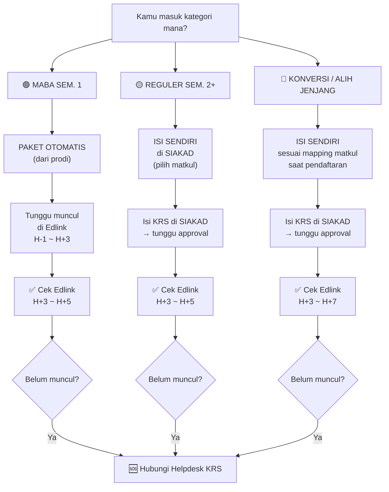

# Decision Tree KRS — Pohon Keputusan Pengisian Kartu Rencana Studi

**Kode dokumen:** DOC-KRS-001  
**Versi:** 0.1  
**Status:** Draf awal  
**Pemilik proses:** HIMA Sistem Informasi / Tim Helpdesk KRS  
**Tanggal berlaku:** `{{YYYY-MM-DD}}`  
**Dokumen terkait:** [`Starter Pack Maba`](./starter-pack-maba-si-pjj.md), [`SOP Siklus Awal Semester`](./SOP_siklus_awal_semester.md)

---

## 1. Tujuan Dokumen

Membantu mahasiswa SI PJJ UNSIA menentukan **jalur pengisian KRS yang benar** berdasarkan status akademik masing-masing, sehingga mengurangi kebingungan dan pertanyaan berulang di awal semester.

> [!NOTE]
> **Realitas Lapangan:** KRS otomatis (dipaketkan prodi) hanya berlaku untuk **mahasiswa semester 1**. Mulai semester 2 ke atas, mahasiswa reguler pun kadang harus mengisi sendiri karena prioritas prodi ke semester 1. Mahasiswa konversi/alih jenjang mengisi sendiri sesuai hasil mapping mata kuliah saat pendaftaran.

---

## 2. Pohon Keputusan

### Langkah 1 — Identifikasi Jalurmu

---

## 3. Penjelasan Detail Per Jalur

### 🟢 Jalur A — Mahasiswa Baru Semester 1 (Reguler)

| Item | Penjelasan |
|---|---|
| **Siapa** | Mahasiswa baru yang baru pertama kali kuliah di UNSIA jalur reguler |
| **Aksi KRS** | **Tidak perlu isi apa-apa** |
| **Alasan** | KRS semester 1 dipaketkan otomatis oleh Program Studi |
| **Yang perlu dilakukan** | Tunggu mata kuliah muncul di Edlink (H+1 s.d. H+3 setelah kuliah perdana) |
| **Risiko/Catatan** | Jika H+5 Edlink masih kosong → hubungi Helpdesk KRS |

**Alur langkah:**
1. Pastikan registrasi dan pembayaran sudah selesai ✅
2. Login ke SIAKAD → cek apakah KRS sudah terisi otomatis
3. Tunggu kelas muncul di Edlink (normal butuh H+1 s.d. H+3)
4. Jika H+5 masih kosong → hubungi Helpdesk KRS

---

### 🟡 Jalur B — Mahasiswa Reguler Semester 2 ke Atas

| Item | Penjelasan |
|---|---|
| **Siapa** | Mahasiswa aktif reguler yang sudah pernah menjalani minimal 1 semester |
| **Aksi KRS** | **Isi sendiri di SIAKAD** — pilih mata kuliah yang ingin diambil |
| **Alasan** | Prodi memprioritaskan pemaketan otomatis ke semester 1. Semester 2+ sering harus mengisi mandiri |
| **Yang perlu dilakukan** | Buka SIAKAD → menu KRS → pilih mata kuliah → submit → tunggu approval |
| **Risiko/Catatan** | Perhatikan prasyarat mata kuliah (*prerequisite*). Jangan pilih matkul yang prasyaratnya belum lulus |

**Alur langkah:**
1. Login ke SIAKAD
2. Buka menu KRS / Pengisian KRS
3. Pilih mata kuliah yang ingin diambil semester ini
4. Pastikan tidak bentrok jadwal (kalau ada info jadwal)
5. Submit KRS
6. Tunggu approval dari Penasehat Akademik (PA) / Prodi
7. Setelah disetujui → kelas muncul di Edlink (H+1 s.d. H+5)
8. Jika H+5 Edlink masih kosong → hubungi Helpdesk KRS

---

### 🔵 Jalur C — Mahasiswa Konversi / Alih Jenjang (Transfer)

| Item | Penjelasan |
|---|---|
| **Siapa** | Mahasiswa transfer dari perguruan tinggi lain, atau alih jenjang D3→S1 |
| **Aksi KRS** | **Isi sendiri di SIAKAD** sesuai hasil mapping mata kuliah saat pendaftaran |
| **Alasan** | Setiap mahasiswa konversi punya daftar mapping yang berbeda tergantung transkrip asal |
| **Yang perlu dilakukan** | Buka dokumen mapping → cocokkan dengan matkul yang tersedia di SIAKAD → isi KRS → submit |
| **Risiko/Catatan** | Kalau bingung membaca mapping, **konsultasi ke PA terlebih dahulu** sebelum isi KRS |

**Alur langkah:**
1. Siapkan dokumen hasil mapping/konversi mata kuliah (diterima saat pendaftaran)
2. Login ke SIAKAD
3. Buka menu KRS / Pengisian KRS
4. Cocokkan: matkul di mapping → pilih matkul yang sesuai di SIAKAD
5. Jika ragu → **konsultasi ke Penasehat Akademik (PA)** sebelum submit
6. Submit KRS
7. Tunggu approval
8. Setelah disetujui → kelas muncul di Edlink (H+3 s.d. H+7, bisa lebih lama dari reguler)
9. Jika H+7 Edlink masih kosong → hubungi Helpdesk KRS

> [!IMPORTANT]
> **Simpan dokumen mapping-mu.** Kamu akan membutuhkannya setiap semester untuk menentukan mata kuliah berikutnya.

---

## 4. Panduan Cepat: Status KRS dan Artinya

| Status di SIAKAD | Artinya | Apa yang Harus Dilakukan |
|---|---|---|
| **Belum Diisi** | KRS belum diinput | Isi KRS (Jalur B & C) atau tunggu paket (Jalur A) |
| **Diajukan** | KRS sudah disubmit, menunggu approval | Tunggu. Jangan edit. |
| **Disetujui** | KRS sudah diapprove oleh PA/Prodi | ✅ Kelas akan segera muncul di Edlink |
| **Ditolak** | Ada masalah dengan KRS-mu | Cek catatan penolakan → perbaiki → submit ulang |
| **Batal** | KRS dibatalkan | Hubungi PA untuk klarifikasi |

---

## 5. Troubleshooting Umum

| Masalah | Kemungkinan Penyebab | Solusi |
|---|---|---|
| KRS kosong padahal sudah bayar | Proses pemaketan belum jalan (Jalur A) atau belum mengisi (Jalur B/C) | Jalur A: tunggu. Jalur B/C: isi sendiri. |
| Edlink kosong padahal KRS sudah disetujui | Sinkronisasi SIAKAD→Edlink butuh waktu | Tunggu H+3. Jika H+5 masih kosong → Helpdesk. |
| Tidak bisa memilih matkul tertentu di SIAKAD | Prasyarat belum terpenuhi, atau kuota penuh, atau belum dibuka prodi | Konsultasi PA. |
| KRS ditolak tanpa penjelasan | PA/Prodi menolak karena alasan tertentu | Hubungi PA langsung untuk klarifikasi. |
| Matkul di mapping tidak ada di SIAKAD | Kode matkul mungkin berubah atau belum dibuka semester ini | Konsultasi PA. |

---

## 6. Kontak Helpdesk KRS

| Kanal | Detail | Kapan Aktif |
|---|---|---|
| **Helpdesk KRS HIMA** | `[LINK GRUP/FORM AKAN DICANTUMKAN]` | H-7 s.d. H+14 setiap awal semester |
| **Penasehat Akademik (PA)** | Cek nama PA di SIAKAD → hubungi via Edlink/email | Selama semester aktif |
| **Sekretaris Prodi** | Eskalasi terakhir — hanya untuk masalah sistem/administrasi | Jam kerja |

> [!WARNING]
> **Gunakan Helpdesk terlebih dahulu** sebelum menghubungi PA atau Sekprodi. Helpdesk HIMA dirancang untuk menyelesaikan pertanyaan KRS umum tanpa membebani pimpinan prodi.

---

## 7. Informasi Versi Dokumen

| Versi | Tanggal | Perubahan |
|---|---|---|
| 0.1 | `{{YYYY-MM-DD}}` | Draf awal — 3 jalur (Maba Sem.1, Reguler Sem.2+, Konversi) |

> Dokumen ini diperbarui setiap awal semester berdasarkan informasi terbaru dari Program Studi dan log pertanyaan Helpdesk KRS semester sebelumnya.

---

*Dokumen ini merupakan bagian dari seri deliverable reformasi tata kelola HIMA Sistem Informasi PJJ UNSIA.*
