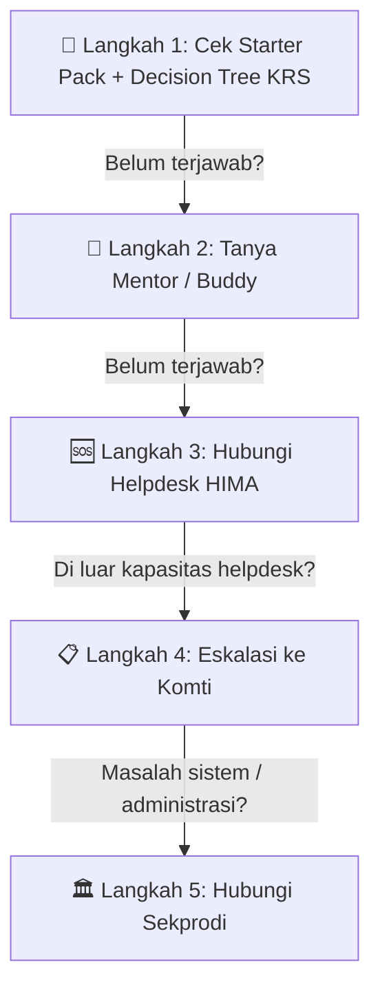

# Starter Pack Mahasiswa Baru — PJJ Sistem Informasi UNSIA

**Kode dokumen:** DOC-MABA-001  
**Versi:** 0.1  
**Status:** Draf awal  
**Pemilik proses:** HIMA Sistem Informasi / Tim Onboarding  
**Tanggal berlaku:** `{{YYYY-MM-DD}}`  
**Dokumen terkait:** [`SOP Siklus Awal Semester`](./SOP_siklus_awal_semester.md), [`Decision Tree KRS`](./decision-tree-krs.md)

---

## 1. Selamat Datang di SI PJJ UNSIA! 🎓

Selamat datang, kamu resmi menjadi mahasiswa Program Studi Sistem Informasi, Pendidikan Jarak Jauh (PJJ), Universitas Siber Asia (UNSIA)!

Dokumen ini adalah **panduan lengkap satu pintu** (*single source of truth*) untuk membantumu menavigasi minggu-minggu pertama perkuliahan. Simpan baik-baik, karena hampir semua pertanyaan umum yang muncul di awal semester sudah dijawab di sini.

> [!TIP]
> **Bookmark dokumen ini.** Kamu tidak perlu menghafalnya sekarang — cukup buka lagi kapanpun kamu bingung.

---

## 2. Peta Ekosistem Digital UNSIA

UNSIA memiliki **2 platform utama** yang wajib kamu pahami. Keduanya berbeda fungsi dan menggunakan **login terpisah**:

```
┌──────────────────────────────────────────────────────────────────┐
│                    EKOSISTEM DIGITAL UNSIA                        │
├────────────────────────────┬─────────────────────────────────────┤
│         📊 SIAKAD          │            📚 EDLINK                │
│   (Sistem Informasi        │   (Learning Management System)     │
│    Akademik)               │                                     │
├────────────────────────────┼─────────────────────────────────────┤
│ ✅ Cek status KRS          │ ✅ Masuk kelas perkuliahan daring   │
│ ✅ Lihat nilai & transkrip │ ✅ Akses materi, slide, modul      │
│ ✅ Cek jadwal kuliah       │ ✅ Submit tugas & kuis              │
│ ✅ Cetak kartu ujian       │ ✅ Ikut forum diskusi kelas         │
│ ✅ Cek status pembayaran   │ ✅ Lihat pengumuman dari dosen      │
├────────────────────────────┼─────────────────────────────────────┤
│ 🔗 URL: siakad.unsia.ac.id│ 🔗 URL: edlink.unsia.ac.id         │
│ 🔑 Login: NIM + password  │ 🔑 Login: email kampus + password  │
│    yang diberikan kampus   │    yang diberikan kampus            │
└────────────────────────────┴─────────────────────────────────────┘
```

### Pertanyaan yang Sering Muncul

| Pertanyaan | Jawaban |
|---|---|
| **"Apa bedanya SIAKAD dan Edlink?"** | SIAKAD = administrasi (nilai, KRS, pembayaran). Edlink = kelas online (materi, tugas, kuis). Keduanya **harus** diakses. |
| **"Kok saya belum bisa login?"** | Akun kampus biasanya aktif 1-3 hari setelah registrasi selesai. Jika lebih dari 3 hari belum bisa, hubungi eskalasi (lihat Bagian 8). |
| **"Password saya apa?"** | Password awal biasanya dikirim via email/SMS saat pendaftaran. Jika lupa, gunakan fitur "Lupa Password" di halaman login. |
| **"Kenapa Edlink saya kosong?"** | Kelas di Edlink baru muncul setelah KRS disetujui dan disinkronisasi oleh sistem. Biasanya butuh H+1 s.d. H+3 setelah kuliah perdana dimulai. **Jangan panik.** |

---

## 3. Alur Pengisian KRS (Kartu Rencana Studi)

KRS adalah "daftar belanja" mata kuliahmu untuk semester ini. **Tanpa KRS yang disetujui, kamu tidak bisa masuk kelas di Edlink.**

### Kamu masuk jalur yang mana?

| Jalur | Keterangan | Apa yang Harus Dilakukan |
|---|---|---|
| **🟢 Maba Semester 1 (Reguler)** | Mahasiswa baru jalur reguler | **Tidak perlu isi apa-apa.** KRS kamu sudah dipaketkan otomatis oleh prodi. Tinggal tunggu muncul di Edlink. |
| **🟡 Reguler Semester 2+** | Mahasiswa aktif yang sudah pernah kuliah | **Isi sendiri di SIAKAD** — pilih mata kuliah yang ingin diambil. Prodi memprioritaskan paket ke semester 1, jadi semester 2+ biasanya harus mandiri. |
| **🔵 Konversi / Alih Jenjang** | Mahasiswa transfer / D3→S1 | **Isi sendiri di SIAKAD** sesuai hasil mapping mata kuliah yang kamu terima saat pendaftaran. Kalau bingung, konsultasi ke Penasehat Akademik (PA). |

> [!NOTE]
> **Decision tree lengkap** ada di dokumen terpisah: [`Decision Tree KRS`](./decision-tree-krs.md)

### Timeline KRS yang Perlu Kamu Tahu

| Kapan | Apa yang Terjadi | Apa yang Harus Kamu Lakukan |
|---|---|---|
| **H-7** (1 minggu sebelum kuliah) | KRS mulai bisa diisi | Cek status di SIAKAD |
| **H-1** (sehari sebelum kuliah) | Kuliah perdana besok | Kelas di Edlink mungkin belum muncul — **ini normal** |
| **H+1 s.d. H+3** | Sinkronisasi SIAKAD → Edlink | Cek Edlink secara berkala |
| **H+3 s.d. H+5** | Kelas seharusnya sudah muncul | Kalau masih kosong → hubungi Helpdesk KRS |
| **H+7 s.d. H+14** | Batas batal-tambah | Pastikan KRS kamu sudah final |

---

## 4. Grup Kelas WhatsApp

Setiap mata kuliah biasanya punya grup WhatsApp untuk koordinasi. Grup ini bisa dibuat oleh **dosen**, **HIMA**, atau **mahasiswa**.

### Cara Menemukan Grup Kelasmu

**Jangan cari grup satu per satu di chat.** Semua tautan grup kelas dikumpulkan di satu tempat:

> 📂 **Direktori Grup Kelas**  
> `[LINK DIREKTORI AKAN DICANTUMKAN DI SINI OLEH KOORDINATOR HIMA]`

Direktori ini berisi daftar lengkap semua grup kelas beserta:
- Kode dan nama mata kuliah
- Nama dosen (jika sudah terdata)
- Tautan grup (sudah diverifikasi)
- Status (aktif / kedaluwarsa / dialihkan)

### Kalau Kamu Punya Tautan Grup yang Belum Ada di Direktori

Jangan share langsung di grup civitas. **Submit melalui form** agar bisa diverifikasi dan dimasukkan ke direktori resmi:

> 📝 **Form Submit Tautan Grup**  
> `[LINK FORM AKAN DICANTUMKAN DI SINI OLEH KOORDINATOR HIMA]`

---

## 5. Kalender Kritis Semester

Berikut tanggal-tanggal penting yang perlu kamu tandai di kalender:

| Periode | Aktivitas | Catatan |
|---|---|---|
| **Minggu ke -2** | Pembukaan KRS | Cek SIAKAD |
| **Minggu ke -1** | Deadline pengisian KRS | Pastikan sudah diisi/dipaketkan |
| **Minggu ke 1** | Kuliah perdana | Edlink mulai aktif (mungkin delay 1-3 hari) |
| **Minggu ke 2** | Batas batal-tambah KRS | Keputusan final mata kuliah |
| **Minggu ke 7-8** | UTS (Ujian Tengah Semester) | Cek jadwal di SIAKAD |
| **Minggu ke 14-16** | UAS (Ujian Akhir Semester) | Cetak kartu ujian di SIAKAD |

> [!IMPORTANT]
> Tanggal pasti berbeda setiap semester. Selalu cek pengumuman resmi dari Prodi.

---

## 6. Tips Bertahan di PJJ 💡

| Tips | Penjelasan |
|---|---|
| **Buat jadwal belajar tetap** | Kuliah online bukan berarti bebas waktu. Tetapkan jam belajar harian. |
| **Jangan tumpuk tugas** | Submit tugas begitu selesai, jangan tunggu deadline. Edlink kadang lambat saat banyak yang akses bersamaan. |
| **Aktif di forum kelas** | Keaktifan di forum sering masuk penilaian. Minimal baca dan respon diskusi. |
| **Simpan bukti submit tugas** | Screenshot halaman konfirmasi submit. Jaga-jaga kalau ada error sistem. |
| **Gabung grup kelas di awal** | Jangan tunda masuk grup WhatsApp kelas — info penting sering dishare di sana duluan. |
| **Kenali dosenmu** | Perhatikan cara setiap dosen memberikan instruksi. Ada yang lewat Edlink, ada yang lewat WA. |

---

## 7. FAQ (Pertanyaan yang Sering Ditanyakan)

### Akun & Login

| # | Pertanyaan | Jawaban |
|---|---|---|
| 1 | Kapan akun kampus saya aktif? | Biasanya 1-3 hari setelah registrasi dan pembayaran selesai. |
| 2 | Email kampus saya apa? | Format biasanya `nim@students.unsia.ac.id`. Cek email/SMS yang dikirim saat pendaftaran. |
| 3 | Saya lupa password, bagaimana? | Gunakan fitur "Lupa Password" di halaman login SIAKAD/Edlink. |
| 4 | Kenapa saya bisa login SIAKAD tapi tidak bisa login Edlink? | Keduanya punya kredensial berbeda. Akun Edlink mungkin belum disinkronisasi — tunggu atau hubungi eskalasi. |

### KRS & Mata Kuliah

| # | Pertanyaan | Jawaban |
|---|---|---|
| 5 | Saya maba reguler, harus isi KRS sendiri? | Semester 1: tidak, sudah dipaketkan. Semester 2+: kemungkinan harus isi sendiri. |
| 6 | Saya konversi, matkul apa yang harus saya ambil? | Sesuai hasil mapping saat pendaftaran. Konsultasi PA jika ragu. |
| 7 | KRS saya sudah diisi tapi Edlink masih kosong? | Normal. Sinkronisasi butuh H+1 s.d. H+3. Kalau H+5 masih kosong, hubungi Helpdesk. |
| 8 | Apa itu batal-tambah? | Periode di mana kamu masih bisa mengganti mata kuliah. Setelah lewat, KRS terkunci. |

### Grup Kelas

| # | Pertanyaan | Jawaban |
|---|---|---|
| 9 | Bagaimana cara cari grup kelas saya? | Buka Direktori Grup Kelas (lihat Bagian 4). |
| 10 | Saya menemukan tautan grup tapi tidak ada di direktori | Submit lewat Form Tautan Grup agar bisa diverifikasi (lihat Bagian 4). |
| 11 | Ada 2 grup untuk matkul yang sama, yang mana yang benar? | Cek di Direktori — yang berstatus ✅ Aktif yang benar. Grup duplikat biasanya ditandai. |

---

## 8. Alur Eskalasi (Siapa yang Dihubungi Kalau Butuh Bantuan)

Ikuti urutan ini **dari atas ke bawah**. Jangan langsung lompat ke paling bawah:



> [!WARNING]
> **Jangan langsung menghubungi Sekprodi untuk pertanyaan yang jawabannya ada di dokumen ini.** Langkah 1-3 dirancang untuk menyelesaikan 80%+ pertanyaan umum awal semester. Sekprodi fokus pada masalah yang benar-benar membutuhkan intervensi administratif.

---

## 9. Informasi Versi Dokumen

| Versi | Tanggal | Perubahan |
|---|---|---|
| 0.1 | `{{YYYY-MM-DD}}` | Draf awal |

> Dokumen ini akan diperbarui setiap awal semester oleh Tim Onboarding HIMA sesuai informasi terbaru dari Program Studi.

---

*Dokumen ini merupakan bagian dari seri deliverable reformasi tata kelola HIMA Sistem Informasi PJJ UNSIA.*
