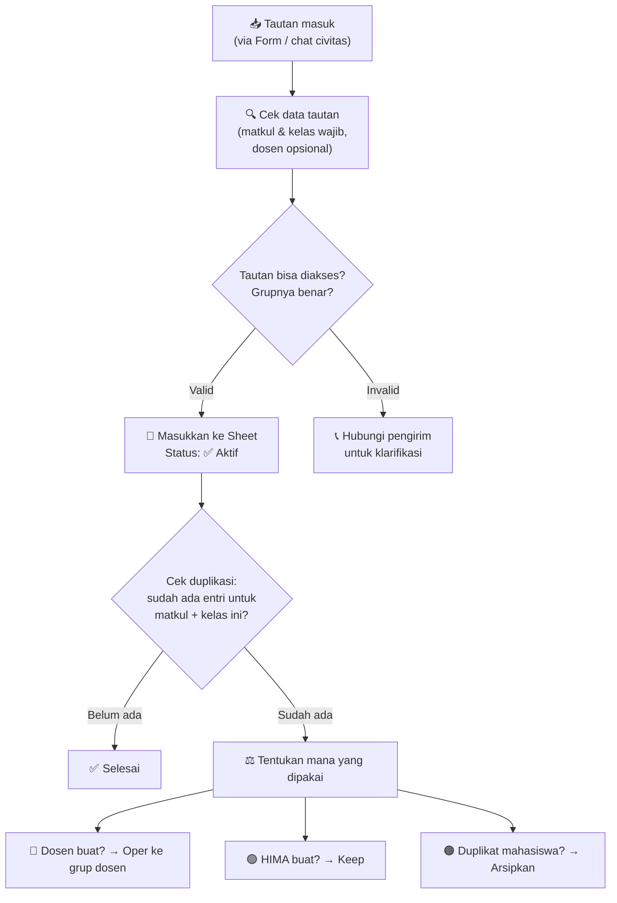

# Template Direktori Grup Kelas & Form Submission

**Kode dokumen:** TPL-GRUP-001  
**Versi:** 0.1  
**Status:** Draf awal  
**Pemilik proses:** HIMA Sistem Informasi / Koordinator Kelas  
**Tanggal berlaku:** `{{YYYY-MM-DD}}`  
**Dokumen terkait:** [`SOP Siklus Awal Semester`](./SOP_siklus_awal_semester.md), [`Starter Pack Maba`](./starter-pack-maba-si-pjj.md)

---

## 1. Tujuan

Menyediakan **satu sumber kebenaran tunggal** (*single source of truth*) untuk seluruh tautan grup kelas mata kuliah SI PJJ UNSIA, menggantikan pola pesan berantai berserakan di grup WhatsApp civitas.

> [!IMPORTANT]
> **Model Hybrid & Keterbatasan Akses Data Dosen:**
> - HIMA bertindak sebagai **kurator direktori**, bukan pembuat seluruh grup. Grup bisa berasal dari dosen, HIMA, atau mahasiswa — semuanya dikumpulkan dan diverifikasi di satu tempat.
> - **Catatan Akses:** HIMA **tidak memiliki akses administratif** ke data penugasan dosen pengampu per mata kuliah/kelas dari Prodi. Karena itu, informasi dosen didapatkan secara *crowdsourced* (dari mahasiswa yang melihatnya di Edlink/SIAKAD masing-masing, atau saat dosen membagikan tautan). Kolom dosen bersifat opsional dan dilengkapi bertahap.

---

## 2. Struktur Direktori (Google Sheets / Notion / Portal)

### Kolom Wajib & Informasi Kelas

| No | Nama Kolom | Tipe Data | Penjelasan |
|---|---|---|---|
| 1 | **Kode Matkul** | Teks | Kode resmi mata kuliah (contoh: SI101) |
| 2 | **Nama Mata Kuliah** | Teks | Nama lengkap mata kuliah |
| 3 | **Kelas** | Teks | Huruf kelas (A, B, C, dst.) |
| 4 | **Dosen Pengampu** | Teks | Nama dosen *(opsional / isi `-` jika belum diketahui di Edlink)* |
| 5 | **Tipe Grup** | Dropdown | `Grup Biasa` / `Sub-grup Community` / `Community` |
| 6 | **Nama Grup/Community** | Teks | Nama grup WA sesuai yang tertera di aplikasi |
| 7 | **Sumber** | Dropdown | `🟢 HIMA` / `🔵 Dosen` / `🟠 Mahasiswa` |
| 8 | **Link Grup** | URL | Tautan invite grup (chat.whatsapp.com/...) |
| 9 | **Status** | Dropdown | `✅ Aktif` / `❌ Expired` / `🔄 Dialihkan` / `⏳ Belum Diverifikasi` |
| 10 | **Catatan** | Teks | Info tambahan (misal: "Dialihkan ke grup dosen → [link]") |
| 11 | **Terakhir Diverifikasi** | Tanggal | Kapan terakhir link dicek dan dikonfirmasi aktif |
| 12 | **Diverifikasi Oleh** | Teks | Nama koordinator yang memverifikasi |

### Kolom Opsional

| No | Nama Kolom | Penjelasan |
|---|---|---|
| 13 | **Semester** | Periode semester (contoh: Ganjil 2026/2027) |
| 14 | **Angkatan Utama** | Angkatan yang mayoritas mengambil matkul ini |
| 15 | **Jumlah Anggota Grup** | Tracking jumlah mahasiswa yang sudah join |

---

## 3. Contoh Isian Direktori

### Contoh: Grup Biasa

```
Semester Ganjil 2026/2027 — Direktori Grup Kelas SI PJJ

Kode  | Mata Kuliah       | Kls | Dosen       | Tipe        | Nama Grup                            | Sumber   | Link        | Status
------|-------------------|-----|-------------|-------------|--------------------------------------|----------|-------------|--------
SI101 | Peng. Tek. Info   | A   | Dr. Ahmad   | Grup Biasa  | 2026SI101-A Pengantar Tek Info       | 🟢 HIMA  | [LINK]      | ✅ Aktif
SI101 | Peng. Tek. Info   | B   | Dr. Ahmad   | Grup Biasa  | PTI Kelas B Dr Ahmad                 | 🔵 Dosen | [LINK]      | ✅ Aktif
SI201 | Basis Data        | A   | -           | Grup Biasa  | 2026SI201-A Basis Data               | 🟢 HIMA  | [LINK]      | ✅ Aktif
```

### Contoh: WA Community

```
Kode  | Mata Kuliah       | Kls | Dosen       | Tipe               | Nama Grup/Community                  | Sumber   | Link        | Status
------|-------------------|-----|-------------|--------------------|--------------------------------------|----------|-------------|--------
SI305 | Rek. Per. Lunak   | A   | Dr. Citra   | Community          | Community "RPL Dr. Citra 2026"       | 🔵 Dosen | [LINK]      | ✅ Aktif
SI305 | Rek. Per. Lunak   | A   | Dr. Citra   | Sub-grup Community | → Sub-grup: "RPL Kelas A"            | 🔵 Dosen | [LINK]      | ✅ Aktif
SI305 | Rek. Per. Lunak   | B   | Dr. Citra   | Sub-grup Community | → Sub-grup: "RPL Kelas B"            | 🔵 Dosen | [LINK]      | ✅ Aktif
```

### Contoh: Grup Dialihkan (Duplikasi Resolved)

```
Kode  | Mata Kuliah       | Kls | Dosen       | Tipe        | Nama Grup                            | Sumber   | Link        | Status       | Catatan
------|-------------------|-----|-------------|-------------|--------------------------------------|----------|-------------|--------------|--------
SI401 | Proyek Akhir      | A   | Dr. Dani    | Grup Biasa  | 2026SI401-A Proyek Akhir             | 🟢 HIMA  | [LINK LAMA] | 🔄 Dialihkan | Pindah ke grup dosen → [LINK BARU]
SI401 | Proyek Akhir      | A   | Dr. Dani    | Grup Biasa  | PA Kelas A Dr Dani                   | 🔵 Dosen | [LINK BARU] | ✅ Aktif     | Grup resmi (dosen yang buat)
```

---

## 4. Panduan Status Grup

| Status | Emoji | Artinya | Aksi Mahasiswa |
|---|---|---|---|
| **Aktif** | ✅ | Grup terverifikasi dan bisa di-join | Join lewat link yang tertera |
| **Expired** | ❌ | Link sudah kedaluwarsa atau grup dihapus | Jangan join — tunggu update dari koordinator |
| **Dialihkan** | 🔄 | Grup ini digantikan oleh grup lain | Pindah ke grup yang ditunjuk di kolom Catatan |
| **Belum Diverifikasi** | ⏳ | Link baru masuk, belum dicek oleh koordinator | Tunggu verifikasi sebelum join |

---

## 5. Template Google Form: Submission Tautan Grup

Berikut daftar field untuk Google Form yang digunakan mahasiswa/dosen/komti untuk submit tautan grup baru:

### Field Form

| # | Nama Field | Tipe | Wajib | Penjelasan |
|---|---|---|---|---|
| 1 | **Nama Pengisi** | Short text | ✅ | Siapa yang submit |
| 2 | **Kode Mata Kuliah** | Short text | ✅ | Contoh: SI101 |
| 3 | **Nama Mata Kuliah** | Short text | ✅ | Nama lengkap |
| 4 | **Kelas** | Short text | ✅ | Huruf kelas (A, B, dst.) |
| 5 | **Nama Dosen (jika tahu)** | Short text | ❌ | Dosen pengampu (opsional; kosongkan jika belum tertera di Edlink/SIAKAD) |
| 6 | **Link Grup** | URL | ✅ | chat.whatsapp.com/... |
| 7 | **Siapa yang membuat grup ini?** | Multiple choice | ✅ | Dosen / Saya (mahasiswa) / HIMA / Tidak tahu |
| 8 | **Tipe** | Multiple choice | ✅ | Grup WA Biasa / WA Community / Sub-grup dari Community |
| 9 | **Nama Community (jika sub-grup)** | Short text | ❌ | Nama Community induk |
| 10 | **Catatan tambahan** | Paragraph | ❌ | Info lain yang relevan |

### Pesan Konfirmasi (Setelah Submit)

```
Terima kasih! Tautan grup kamu sudah kami terima.

⏳ Status: Belum Diverifikasi
Koordinator HIMA akan memverifikasi tautan ini dalam waktu 1x24 jam.
Setelah diverifikasi, tautan akan muncul di Direktori Grup Kelas resmi.

Jangan share tautan ini langsung di grup civitas — gunakan link Direktori agar semua tautan terpusat.

📂 Direktori Grup Kelas: [LINK DIREKTORI]
```

---

## 6. Panduan untuk Koordinator HIMA

### Alur Kurasi



### Checklist Verifikasi

- [ ] Link bisa diakses (tidak expired)
- [ ] Nama grup sesuai dengan mata kuliah & kelas yang diklaim
- [ ] Tidak ada duplikasi dengan entri yang sudah ada
- [ ] Sumber teridentifikasi (HIMA / Dosen / Mahasiswa)
- [ ] Nama dosen dicatat jika sudah tertera di form/Edlink (opsional)
- [ ] Tipe grup teridentifikasi (Biasa / Community / Sub-grup)
- [ ] Jika ada duplikasi → sudah di-resolve (oper ke dosen / arsipkan)

---

## 7. Standar Penamaan (untuk Grup Buatan HIMA)

> [!NOTE]
> Standar penamaan **hanya berlaku untuk grup yang dibuat HIMA**. Grup buatan dosen atau Community dicatat apa adanya.

```
Format: [TAHUN][KODE_MATKUL]-[KELAS] [NAMA MATKUL]
Contoh: 2026SI101-A Pengantar Teknologi Informasi
        2026SI201-B Basis Data
        2026SI305-A Rekayasa Perangkat Lunak
```

**Manfaat:**
- Searchable di WhatsApp
- Sortable secara alfanumeris
- Mudah diidentifikasi sebagai grup resmi HIMA

---

## 8. Informasi Versi Dokumen

| Versi | Tanggal | Perubahan |
|---|---|---|
| 0.1 | `{{YYYY-MM-DD}}` | Draf awal — model hybrid, support Community & Form submission |

---

*Dokumen ini merupakan bagian dari seri deliverable reformasi tata kelola HIMA Sistem Informasi PJJ UNSIA.*
