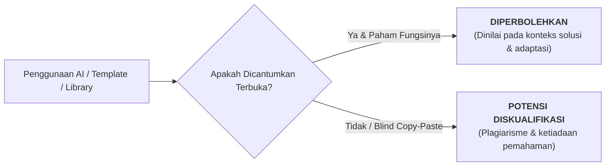
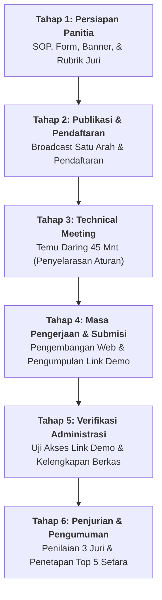

# HIMSISFO Web Innovation Challenge
> **Panduan Lengkap Kompetisi, Kerangka Kerja Produk, dan Pedoman Penjurian**  
> *Inisiatif Program Divisi Perencanaan & Pengembangan Program (P3) HIMSISFO UNSIA*

---

## 1. Gambaran Kegiatan

**HIMSISFO Web Innovation Challenge** adalah kompetisi perancangan dan pembuatan karya berbasis web bagi mahasiswa aktif Universitas Siber Asia (UNSIA). Peserta diberikan kebebasan penuh dalam menentukan tema masalah, ide solusi, maupun tumpukan teknologi (*tech stack*) yang digunakan, selama karya dapat diakses, diuji coba, atau didemonstrasikan secara daring melalui **tautan website (*link demo*) aktif**.

Kompetisi ini **tidak menitikberatkan pada kerumitan kode semata**. Bobot penilaian tertinggi diletakkan pada:
1. Kemampuan mengidentifikasi masalah nyata yang dihadapi pengguna.
2. Membangun solusi digital yang tepat guna dan relevan.
3. Menjelaskan nilai kegunaan produk dengan runtut dan logis.
4. Memastikan fungsi inti sistem berjalan dengan baik (*usable & functional*).

### Skema Penghargaan "Top 5 Setara"
Sebanyak lima karya terbaik akan ditetapkan sebagai **Top 5 Best Web Projects**. Kelima pemenang memperoleh paket hadiah bernilai setara, sertifikat penghargaan resmi, publikasi portofolio di media HIMSISFO, serta prioritas inkubasi/pengembangan lanjutan bersama organisasi.

---

## 2. Latar Belakang

Di lingkungan Pendidikan Jarak Jauh (PJJ), mahasiswa Sistem Informasi membutuhkan sarana aplikatif untuk mengubah teori perkuliahan menjadi luaran nyata. Kompetisi ini hadir sebagai laboratorium praktis bagi mahasiswa untuk:
* Melatih keterampilan pengembangan web (*web development*) dan pola pikir produk (*product thinking*).
* Menjembatani pemahaman proses bisnis ke dalam bentuk antarmuka dan basis data yang nyata.
* Melatih kemampuan komunikasi teknis dalam menjelaskan nilai dari solusi yang dibangun.

Bagi HIMSISFO, kompetisi ini membuktikan fungsi nyata himpunan sebagai akselerator kompetensi mahasiswa. Ruang lingkup masalah dibuka luas: mulai dari isu akademik kampus, kebutuhan operasional organisasi, digitalisasi UMKM, pendidikan, produktivitas, sosial kemasyarakatan, hingga eksplorasi ide kreatif.

---

## 3. Tujuan Kegiatan

### Tujuan Utama
Mendorong mahasiswa menghasilkan karya web yang fungsional, kreatif, berorientasi pengguna, dan memiliki manfaat nyata dalam menyelesaikan masalah sehari-hari.

### Tujuan Khusus
* **Wadah Praktik Nyata**: Mengasah keahlian *front-end*, *back-end*, UI/UX, dan *product management*.
* **Problem-Solving Digital**: Mendorong mahasiswa peka terhadap masalah lingkungan sekitar dan merumuskannya menjadi solusi digital.
* **Artikulasi Produk**: Membiasakan mahasiswa mendefinisikan target pengguna (*user persona*), fitur utama, dan dampak luaran secara profesional.
* **Inklusif bagi Pemula & Mahir**: Memberi ruang aman bagi mahasiswa pemula (dengan solusi sederhana namun tepat guna) maupun yang telah berpengalaman.
* **Koleksi Bank Inovasi HIMSISFO**: Menghasilkan repositori prototipe karya mahasiswa yang dapat diinkubasi lebih lanjut untuk kebutuhan kampus atau masyarakat.

---

## 4. Tema dan Ruang Lingkup Kategori

### Tema Utama
> **“Build a Useful Web Solution”**  
> *Bangun solusi web yang bermanfaat untuk menjawab masalah nyata.*

### Ruang Lingkup Bidang
Tema masalah bersifat **bebas dan terbuka**, asalkan memiliki tujuan dan manfaat yang dapat dijelaskan secara rasional. Peserta dapat memilih salah satu dari 10 bidang eksplorasi berikut:

| Bidang | Fokus Solusi | Contoh Ide Karya |
| :--- | :--- | :--- |
| **Akademik & Kampus** | Mempermudah kehidupan studi mahasiswa PJJ | Panduan KRS interaktif, portal FAQ kampus, kalkulator IPK, bot jadwal kuliah, direktori tugas. |
| **Organisasi & Komunitas** | Efisiensi tata kelola komunitas | Sistem agenda rapat, portal pengumuman satu arah, manajemen pendaftaran acara, database anggota. |
| **UMKM & Usaha Lokal** | Digitalisasi bisnis mandiri/kecil | Katalog produk interaktif, sistem pemesanan via WhatsApp, kalkulator kasir, tracker inventaris stok. |
| **Pendidikan & Edukasi** | Sarana belajar mandiri & interaktif | Kuis materi kuliah, bank flashcard digital, platform catatan materi kuliah SI, latihan koding dasar. |
| **Produktivitas & Pribadi** | Manajemen waktu & kebiasaan | *To-do list* harian, pelacak kebiasaan (*habit tracker*), pencatat keuangan pribadi, perencana proyek. |
| **Karier & Portofolio** | Persiapan profesional mahasiswa | Website portofolio interaktif, generator ringkas CV mahasiswa, pelacak lamaran magang/kerja. |
| **Sosial & Kemanusiaan** | Kepedulian lingkungan sosial | Peta lokasi fasilitas umum, pelaporan kendala fasilitas, portal donasi transparan skala komunitas. |
| **Lingkungan & Energi** | Keberlanjutan & kelestarian alam | Kalkulator jejak karbon sederhana, pelacak penggunaan listrik rumah tangga, panduan daur ulang. |
| **Kreatif & Hiburan** | Media ekspresi visual & logika | Game edukasi berbasis web, generator palet warna, aplikasi penulisan cerita interaktif. |
| **Jejaring & Mentor** | Menghubungkan orang & keahlian | Direktori pencarian teman belajar (*study buddy*), forum tanya jawab minat, direktori mentor koding. |

> [!TIP]
> **Skala Prototipe:**  
> Peserta **tidak dituntut** membuat sistem enterprise raksasa yang 100% sempurna. Prototipe ringkas dengan 1–2 fitur utama yang berjalan stabil jauh lebih dihargai daripada website besar tetapi penuh *bug* atau tidak dapat diakses.

---

## 5. Ketentuan Peserta & Pembagian Peran

### Sasaran Peserta
Mahasiswa aktif Universitas Siber Asia (UNSIA), khususnya mahasiswa Program Studi Sistem Informasi serta program studi serumpun yang memiliki ketertarikan pada rekayasa web, desain digital, dan inovasi produk.

### Ketentuan Kepesertaan
* Kompetisi dapat diikuti secara **Individu** maupun **Tim (Maksimal 3 orang)**.
* Setiap mahasiswa hanya boleh terdaftar pada **satu karya / satu tim**.
* Setiap tim hanya berhak mengumpulkan **satu karya**.

### Panduan Pembagian Peran Tim (Opsional / Fleksibel)
Bagi peserta tim, pembagian peran dapat disesuaikan untuk mempermudah penjelasan kontribusi:

| Peran Tim | Tanggung Jawab Utama |
| :--- | :--- |
| **Project Lead / Product Owner** | Merumuskan latar belakang masalah, arah solusi, koordinasi alur kerja, dan pengisian narasi produk. |
| **Front-End Developer** | Membangun struktur antarmuka web, styling visual, tata letak, dan interaksi pengguna di peramban (*browser*). |
| **Back-End Developer** | Mengelola penyimpanan basis data, autentikasi akun, integrasi API, atau logika pemrosesan data (jika ada). |
| **UI/UX Designer** | Merancang alur pengguna (*user flow*), sketsa tata letak (*wireframe*), dan kenyamanan navigasi. |
| **Content & Researcher** | Menyusun teks konten, melakukan riset kebutuhan pengguna, dan menguji kelayakan fungsi. |

*(Dalam tim kecil atau individu, peserta diperbolehkan merangkap beberapa peran sekaligus).*

---

## 6. Bentuk Karya & Batasan Teknologi

### Bentuk Karya yang Diterima
Karya wajib dapat diakses langsung melalui peramban web (*web browser*), meliputi:
* Website Statis (*Static Site*).
* Website Dinamis (*Dynamic Web App*).
* Single Page Application (SPA) / Progressive Web App (PWA).
* Landing Page Interaktif.
* Dashboard Data / Panel Informasi.
* Sistem Informasi Ringkas.
* Game Berbasis Web (*Web-based Game*).
* Prototipe Web Interaktif yang di-host di platform online.

### Kebebasan Tumpukan Teknologi (*Tech Stack*)
Peserta bebas menggunakan teknologi, pustaka, atau platform apa pun:
* **Dasar**: HTML5, CSS3, JavaScript (Vanilla).
* **Modern Frameworks**: React, Vue, Angular, Svelte, Next.js, Nuxt, Astro, SvelteKit.
* **Backend**: Node.js, Express, PHP (Laravel, CodeIgniter), Python (FastAPI, Flask, Django).
* **Database & BaaS**: Supabase, Firebase, Appwrite, MySQL, PostgreSQL, MongoDB, SQLite.
* **No-Code / Low-Code & CMS**: WordPress, Webflow, Framer, Bubble, atau platform CMS lainnya.
* **Layanan Hosting Gratis**: **GitHub Pages**, Vercel, Netlify, Cloudflare Pages, Firebase Hosting, Render, dsb.

> [!IMPORTANT]
> **Prinsip Kesetaraan Penilaian:**  
> Tidak ada poin otomatis hanya karena menggunakan teknologi rumit. Website HTML/CSS/JS sederhana yang sangat berguna, minim kendala, dan solutif memiliki peluang sama besarnya untuk menjadi Top 5 dibandingkan aplikasi berbasis tumpukan teknologi modern.

### Standar Minimum Karya
* Memiliki nama identitas karya yang jelas.
* Dapat dibuka secara langsung melalui **link demo publik** tanpa *login* Google/izin akses berbayar.
* Memiliki tujuan masalah yang jelas.
* Memiliki setidaknya **satu alur fungsi utama** yang dapat dicoba juri.
* Tampilan antarmuka rapi dan teks terbaca jelas di layar.
* Bebas dari unsur SARA, pornografi, ujaran kebencian, malware, atau pelanggaran hak cipta.

---

## 7. Kebijakan Penggunaan AI, Template, dan Aset

Kompetisi ini mengadopsi realitas industri teknologi modern: **Kecerdasan Buatan (AI) dan aset siap pakai diperbolehkan, dengan prinsip integritas dan transparansi**.



### Regulasi Resmi
1. **Transparansi Wajib**: Peserta wajib menyatakan tools AI (misal: ChatGPT, Claude, GitHub Copilot, v0.dev) atau template/boilerplate yang digunakan pada formulir pengumpulan.
2. **Karya Hasil Pemikiran Sendiri**: AI dan template hanya berfungsi sebagai akselerator (alat bantu pembuatan kode, draf konten, desain ikon, atau pencarian ide). Solusi konseptual, logika pemecahan masalah, dan penyesuaian fungsional harus merupakan hasil kerja peserta.
3. **Pemahaman Penuh**: Peserta wajib memahami bagaimana karyanya bekerja dan mampu menjelaskan alur serta kodenya apabila diminta verifikasi oleh dewan juri.
4. **Lisensi Aset**: Font, ikon, gambar ilustrasi, atau API pihak ketiga wajib berlisensi bebas/legal (*open source, creative commons, free tier*).

---

## 8. Berkas Pengumpulan & Regulasi Link Demo

Pengumpulan berkas dilakukan secara asinkron melalui Google Form resmi dengan komponen:

| Komponen Berkas | Status | Penjelasan |
| :--- | :---: | :--- |
| **Nama Karya** | Wajib | Judul resmi website / produk web. |
| **Data Ketua & Anggota** | Wajib | Nama lengkap, NIM, dan nomor kontak aktif. |
| **Link Demo Website** | **Wajib** | Tautan situs web yang sedang aktif dan dapat diakses publik. |
| **Tautan Source Code** | Opsional | Link repositori GitHub/GitLab publik (sangat dianjurkan). |
| **Akun Demo (Khusus Fitur Login)** | Kondisional | Username/email & password akun simulasi jika sistem membutuhkan hak akses. |
| **Deskripsi & Narasi Produk** | Wajib | Narasi terstruktur menjelaskan masalah, solusi, fitur, dan manfaat. |
| **Daftar Teknologi & Tools AI** | Wajib | Rincian bahasa, framework, pustaka, dan tools AI yang dipakai. |
| **Pernyataan Orisinalitas** | Wajib | Konfirmasi kepatuhan etika lomba. |

### Aturan Ketat Link Demo
* Link demo **wajib aktif tanpa proteksi izin** selama masa penilaian hingga pengumuman pemenang.
* Jika link demo mengalami *down* atau gagal dibuka, panitia akan memberikan **satu kali kesempatan perbaikan dalam rentang 12–24 jam**. Jika tetap tidak dapat dibuka, penilaian fungsionalitas tidak dapat diberikan.
* Seluruh biaya hosting/domain (jika ada) merupakan tanggung jawab peserta; panitia sangat merekomendasikan pemanfaatan hosting gratis (*GitHub Pages, Vercel, Netlify*).

---

## 9. Format Deskripsi Karya (Panduan 500–750 Kata)

Peserta menuangkan narasi karyanya pada formulir dengan struktur 10 pertanyaan pemandu:

1. **Nama Karya**: Nama produk website.
2. **Latar Belakang Masalah**: Masalah apa yang diangkat? Mengapa masalah tersebut penting? Siapa yang merasakannya?
3. **Target Pengguna**: Siapa profil pengguna yang menjadi sasaran utama website ini?
4. **Solusi yang Ditawarkan**: Bagaimana website ini mengatasi masalah tersebut secara praktis?
5. **Fitur Kunci**: 2–4 fungsi utama yang tersedia di dalam website.
6. **Kegunaan & Manfaat**: Apa dampak positif atau perubahan yang dirasakan pengguna setelah memakai website ini?
7. **Motivasi Pemilihan Ide**: Dari mana ide ini berasal (pengalaman pribadi, kendala kuliah PJJ, kebutuhan teman, observasi kerja)?
8. **Daftar Teknologi**: Framework, bahasa, hosting, basis data, atau API yang dipakai.
9. **Transparansi AI / Template**: Alat bantu AI atau template pihak ketiga apa yang digunakan dalam pengerjaan?
10. **Rencana Masa Depan (*Roadmap*)**: Jika dikembangkan lebih lanjut, fitur apa yang ingin ditambahkan?

> #### Contoh Pengisian Draf Singkat:
> * **Nama Karya**: *KRS Helper PJJ*  
> * **Masalah**: Informasi KRS dan jadwal pembayaran sering tenggelam di grup chat, memicu pertanyaan berulang dan kepanikan mahasiswa baru.  
> * **Solusi**: Website satu pintu (*one-stop portal*) yang menyajikan kalender hitung mundur KRS, panduan langkah demi langkah, dan direktori link SIAKAD.  
> * **Manfaat**: Mahasiswa menemukan informasi dalam 3 detik, mengurangi stres awal semester, dan menekan pertanyaan repetitif di grup.  
> * **Teknologi**: HTML, Tailwind CSS, JavaScript, GitHub Pages.

---

## 10. Alur dan Mekanisme Pelaksanaan

Rangkaian kompetisi dirancang terstruktur dalam **6 tahapan pelaksanaan**:



| Tahap | Aktivitas Utama | Output & Penanggung Jawab |
| :--- | :--- | :--- |
| **1. Persiapan** | Penyusunan form pendaftaran, dokumen panduan, rubrik penilaian, dan instrumen rekap. | Instrumen siap rilis (Divisi P3). |
| **2. Publikasi** | Diseminasi poster dan *caption broadcast* melalui kanal resmi Instagram, WhatsApp Channel, dan grup angkatan. | Pendaftar terdata (Divisi AMI & MK). |
| **3. Technical Meeting** | Sesi daring santai (45–60 menit) via Google Meet untuk menjelaskan format demo, aturan AI, dan tanya jawab. Rekaman video diunggah untuk yang bentrok kerja. | Peserta paham aturan (Divisi P3). |
| **4. Pengerjaan** | Peserta merancang, membangun, dan men-deploy website mereka secara mandiri. | Karya di-deploy ke hosting online. |
| **5. Verifikasi** | Panitia mengecek satu per satu apakah link demo dapat diakses dan kelengkapan akun demo berfungsi. | Daftar karya valid siap uji (Panitia). |
| **6. Penjurian** | Dewan juri menguji link demo secara langsung, membaca narasi produk, dan menginput skor penilaian. | Terpilih Top 5 Best Web Projects. |

### Komposisi Profil Dewan Juri (3 Penilai Objektif):
1. **Juri Teknis (Dosen / Praktisi Industri)**: Menilai arsitektur sistem, kelayakan fungsi, dan performa teknis.
2. **Juri Produk & Relevansi (Product-Minded Reviewer / Pengurus HIMA)**: Menilai ketajaman identifikasi masalah, kegunaan nyata, dan relevansi solusi.
3. **Juri Antarmuka & UX (UI/UX Designer / Web Developer)**: Menilai kerapian tampilan, kemudahan navigasi, responsivitas mobile, dan kenyamanan visual.

---

## 11. Rubrik dan Pedoman Penilaian (Total 100 Poin)

| Aspek Penilaian | Bobot | Kriteria & Indikator Penilaian |
| :--- | :---: | :--- |
| **Manfaat & Relevansi Masalah** | **30 Poin** | Ketajaman analisis masalah, kejelasan target pengguna, dan seberapa besar nilai guna solusi yang ditawarkan dalam memecahkan masalah riil. |
| **Fungsionalitas Karya** | **25 Poin** | Fitur utama berjalan stabil tanpa kendala kritis (*error/broken link*), alur navigasi jelas, dan sistem dapat diuji langsung oleh juri. |
| **Inovasi & Kualitas Ide** | **20 Poin** | Kreativitas pendekatan solusi, keunikan sudut pandang, atau kemampuan memodifikasi masalah umum menjadi solusi yang lebih segar dan kontekstual. |
| **User Experience (UX) & Desain** | **15 Poin** | Kerapian tampilan visual, keterbacaan tipografi, responsivitas pada layar ponsel/laptop, dan kemudahan pengguna menyelesaikan alur tugas. |
| **Kejelasan Penjelasan Produk** | **10 Poin** | Kejujuran dan keruntutan penjelasan masalah, teknologi, transparansi penggunaan AI/template, serta rencana pengembangan produk ke depan. |

### Panduan Skala Skor Juri:
* **90 – 100**: *Luar Biasa* (Sangat matang, fungsional penuh, dampak solusi sangat nyata dan siap pakai).
* **75 – 89**: *Baik* (Solusi terdefinisi jelas, fungsional baik, visual rapi, memiliki nilai guna kuat).
* **60 – 74**: *Cukup* (Fitur inti berjalan, ide relevan, namun masih membutuhkan penyempurnaan alur/tampilan).
* **40 – 59**: *Kurang* (Fungsi belum stabil, masalah kurang terdefinisi, atau tautan sulit dioperasikan).
* **0 – 39**: *Tidak Layak* (Karya tidak dapat dibuka, tidak fungsional, atau terindikasi plagiarisme penuh).

---

## 12. Sistem Penetapan Top 5 Setara (*Equality Principle*)

HIMSISFO menerapkan sistem pemenang setara untuk membangun iklim inovasi yang sehat:

1. **Tanpa Hierarki Juara Bertingkat**: Tidak ada istilah Juara 1, 2, atau 3. Lima karya dengan akumulasi nilai tertinggi dinobatkan bersama sebagai **Top 5 Best Web Projects**.
2. **Apresiasi Bernilai Sama**: Kelima pemenang menerima nominal apresiasi, piagam penghargaan, dan eksposur media yang sama rata.
3. **Aturan Pemecah Seri (*Tie-Breaker*)**:
   * Jika terjadi skor imbang pada peringkat ke-5, prioritas diberikan pada nilai tertinggi aspek **Manfaat & Relevansi Masalah**.
   * Jika masih imbang, prioritas kedua adalah nilai aspek **Fungsionalitas Karya**.
   * Jika tetap imbang, dewan juri mengadakan musyawarah singkat untuk menetapkan keputusan akhir yang bersifat mutlak.

---

## 13. Paket Hadiah dan Bentuk Apresiasi

Paket apresiasi bagi pemenang **Top 5 Best Web Projects**:
* **Uang Pembinaan / Saldo E-Wallet** dengan nominal setara per pemenang.
* **Sertifikat Penghargaan Resmi** bertanda tangan Ketua HIMSISFO dan Dosen Pembina/Kaprodi.
* **Publikasi Khusus Portofolio Karya** di website resmi, Instagram, dan LinkedIn HIMSISFO.
* **Prioritas Inkubasi**: Peluang karya terpilih untuk diadopsi menjadi sistem resmi kampus atau dikembangkan bersama tim teknologi himpunan.
* **E-Sertifikat Kepesertaan** bagi seluruh peserta yang berhasil mengumpulkan karya valid.

---

## 14. Materi Publikasi Siap Pakai (*Broadcast & Caption*)

```text
🚀 [HIMSISFO WEB INNOVATION CHALLENGE 2026] 🚀
"Build a Useful Web Solution"

Punya ide website yang bermanfaat untuk mempermudah hidup mahasiswa, UMKM, atau lingkungan sekitarmu? Saatnya wujudkan idemu menjadi karya nyata!

HIMSISFO UNSIA mengundang seluruh mahasiswa aktif untuk berkarya dalam kompetisi pembuatan website dengan tema bebas dan berorientasi solusi nyata.

✨ KENAPA HARUS IKUT?
1. Tema Bebas: Solusi akademik, UMKM, produktivitas, portofolio, edukasi, hingga game interaktif.
2. Bebas Teknologi: HTML/CSS, React, Laravel, WordPress, Python, hingga No-Code/AI Tools diperbolehkan!
3. Format Fleksibel: Individu atau Tim (Maks. 3 orang).
4. Praktis: Cukup kumpulkan LINK DEMO website aktif (tanpa ribet bikin video penjelasan).
5. Sistem Apresiasi Setara: 5 Karya Terbaik akan dinobatkan sebagai Top 5 Best Web Projects dengan hadiah & sertifikat penghargaan yang sama!

🗓️ JADWAL KEGIATAN:
• Pendaftaran & Pengerjaan : [Tanggal Mulai] – [Tanggal Selesai]
• Technical Meeting (Daring) : [Tanggal & Jam] (Tersedia rekaman)
• Batas Akhir Submisi Link  : [Tanggal & Pukul 23.59 WIB]
• Pengumuman Top 5 Pemenang  : [Tanggal Pengumuman]

🔗 Link Panduan & Ketentuan Lengkap: bit.ly/Panduan-HIMSISFO-WIC
🔗 Link Pendaftaran & Pengumpulan : bit.ly/Daftar-HIMSISFO-WIC

Jangan hanya punya ide di kepala—bangun, publikasikan, dan tunjukkan solusi digitalmu sekarang juga! 💻✨

#HIMSISFO #SistemInformasiUNSIA #WebInnovationChallenge #BangunSolusiNyata
```

---

## 15. Aturan Ringkas Peserta (*Rulebook 1-Pager*)

1. Terbuka bagi seluruh mahasiswa aktif Universitas Siber Asia (UNSIA).
2. Peserta dapat mendaftar secara **Individu** maupun **Tim (Maks. 3 Orang)**.
3. Karya wajib berupa website yang dapat diakses secara langsung melalui **link demo online**.
4. Peserta bebas menggunakan bahasa pemrograman, framework, pustaka, maupun platform hosting gratis apa pun (*GitHub Pages, Vercel, Netlify, dll.*).
5. Penggunaan AI (*ChatGPT, v0, Copilot*) dan template desain/kode diperbolehkan, dengan **kewajiban mencantumkannya secara jujur** pada form pengumpulan.
6. Penilaian berfokus pada **manfaat dan fungsionalitas solusi**, bukan kerumitan teknologi.
7. Tidak diwajibkan mengumpulkan video; evaluasi dilakukan langsung terhadap link demo dan narasi penjelasan karya.
8. Link demo wajib dapat dibuka dan stabil hingga pengumuman pemenang selesai.
9. Lima karya terbaik akan dinobatkan sebagai **Top 5 Best Web Projects** dengan hak hadiah dan apresiasi yang setara.
10. Keputusan dewan juri bersifat independen, objektif, dan tidak dapat diganggu gugat.
